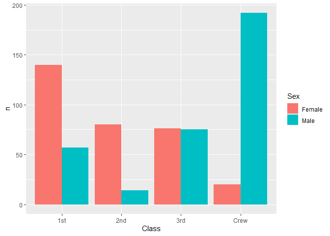
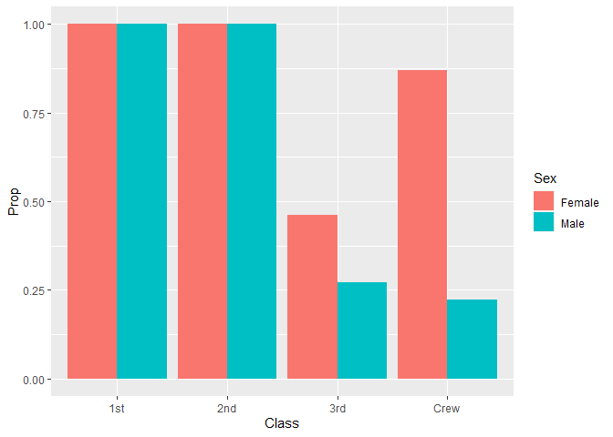
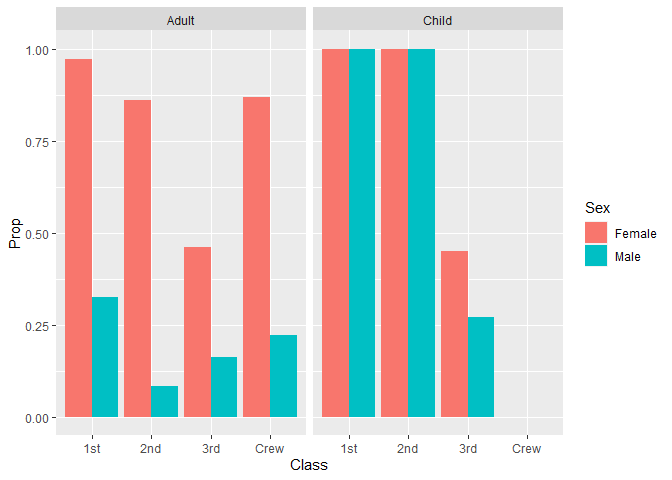
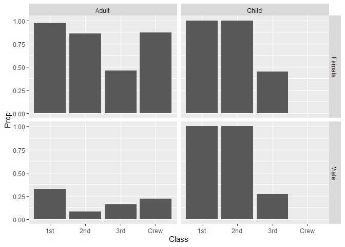

RMS Titanic
================
Jacob Smilg
2023-02-01

- [Grading Rubric](#grading-rubric)
  - [Individual](#individual)
  - [Due Date](#due-date)
- [First Look](#first-look)
  - [**q1** Perform a glimpse of `df_titanic`. What variables are in
    this
    dataset?](#q1-perform-a-glimpse-of-df_titanic-what-variables-are-in-this-dataset)
  - [**q2** Skim the Wikipedia article on the RMS Titanic, and look for
    a total count of souls aboard. Compare against the total computed
    below. Are there any differences? Are those differences large or
    small? What might account for those
    differences?](#q2-skim-the-wikipedia-article-on-the-rms-titanic-and-look-for-a-total-count-of-souls-aboard-compare-against-the-total-computed-below-are-there-any-differences-are-those-differences-large-or-small-what-might-account-for-those-differences)
  - [**q3** Create a plot showing the count of persons who *did*
    survive, along with aesthetics for `Class` and `Sex`. Document your
    observations
    below.](#q3-create-a-plot-showing-the-count-of-persons-who-did-survive-along-with-aesthetics-for-class-and-sex-document-your-observations-below)
- [Deeper Look](#deeper-look)
  - [**q4** Replicate your visual from q3, but display `Prop` in place
    of `n`. Document your observations, and note any new/different
    observations you make in comparison with q3. Is there anything
    *fishy* in your
    plot?](#q4-replicate-your-visual-from-q3-but-display-prop-in-place-of-n-document-your-observations-and-note-any-newdifferent-observations-you-make-in-comparison-with-q3-is-there-anything-fishy-in-your-plot)
  - [**q5** Create a plot showing the group-proportion of occupants who
    *did* survive, along with aesthetics for `Class`, `Sex`, *and*
    `Age`. Document your observations
    below.](#q5-create-a-plot-showing-the-group-proportion-of-occupants-who-did-survive-along-with-aesthetics-for-class-sex-and-age-document-your-observations-below)
- [Notes](#notes)

*Purpose*: Most datasets have at least a few variables. Part of our task
in analyzing a dataset is to understand trends as they vary across these
different variables. Unless we’re careful and thorough, we can easily
miss these patterns. In this challenge you’ll analyze a dataset with a
small number of categorical variables and try to find differences among
the groups.

*Reading*: (Optional) [Wikipedia
article](https://en.wikipedia.org/wiki/RMS_Titanic) on the RMS Titanic.

<!-- include-rubric -->

# Grading Rubric

<!-- -------------------------------------------------- -->

Unlike exercises, **challenges will be graded**. The following rubrics
define how you will be graded, both on an individual and team basis.

## Individual

<!-- ------------------------- -->

| Category    | Needs Improvement                                                                                                | Satisfactory                                                                                                               |
|-------------|------------------------------------------------------------------------------------------------------------------|----------------------------------------------------------------------------------------------------------------------------|
| Effort      | Some task **q**’s left unattempted                                                                               | All task **q**’s attempted                                                                                                 |
| Observed    | Did not document observations, or observations incorrect                                                         | Documented correct observations based on analysis                                                                          |
| Supported   | Some observations not clearly supported by analysis                                                              | All observations clearly supported by analysis (table, graph, etc.)                                                        |
| Assessed    | Observations include claims not supported by the data, or reflect a level of certainty not warranted by the data | Observations are appropriately qualified by the quality & relevance of the data and (in)conclusiveness of the support      |
| Specified   | Uses the phrase “more data are necessary” without clarification                                                  | Any statement that “more data are necessary” specifies which *specific* data are needed to answer what *specific* question |
| Code Styled | Violations of the [style guide](https://style.tidyverse.org/) hinder readability                                 | Code sufficiently close to the [style guide](https://style.tidyverse.org/)                                                 |

## Due Date

<!-- ------------------------- -->

All the deliverables stated in the rubrics above are due **at midnight**
before the day of the class discussion of the challenge. See the
[Syllabus](https://docs.google.com/document/d/1qeP6DUS8Djq_A0HMllMqsSqX3a9dbcx1/edit?usp=sharing&ouid=110386251748498665069&rtpof=true&sd=true)
for more information.

``` r
library(tidyverse)
```

    ## ── Attaching packages ─────────────────────────────────────── tidyverse 1.3.2 ──
    ## ✔ ggplot2 3.4.0      ✔ purrr   1.0.1 
    ## ✔ tibble  3.1.8      ✔ dplyr   1.0.10
    ## ✔ tidyr   1.2.1      ✔ stringr 1.5.0 
    ## ✔ readr   2.1.3      ✔ forcats 0.5.2 
    ## ── Conflicts ────────────────────────────────────────── tidyverse_conflicts() ──
    ## ✖ dplyr::filter() masks stats::filter()
    ## ✖ dplyr::lag()    masks stats::lag()

``` r
df_titanic <- as_tibble(Titanic)
```

*Background*: The RMS Titanic sank on its maiden voyage in 1912; about
67% of its passengers died.

# First Look

<!-- -------------------------------------------------- -->

### **q1** Perform a glimpse of `df_titanic`. What variables are in this dataset?

``` r
df_titanic %>% glimpse()
```

    ## Rows: 32
    ## Columns: 5
    ## $ Class    <chr> "1st", "2nd", "3rd", "Crew", "1st", "2nd", "3rd", "Crew", "1s…
    ## $ Sex      <chr> "Male", "Male", "Male", "Male", "Female", "Female", "Female",…
    ## $ Age      <chr> "Child", "Child", "Child", "Child", "Child", "Child", "Child"…
    ## $ Survived <chr> "No", "No", "No", "No", "No", "No", "No", "No", "No", "No", "…
    ## $ n        <dbl> 0, 0, 35, 0, 0, 0, 17, 0, 118, 154, 387, 670, 4, 13, 89, 3, 5…

**Observations**:

- `Class` (“1st”, “2nd”, “3rd”, “Crew”), `Sex` (“Male”, “Female”), `Age`
  (“Child”, “Adult”), `Survived` (“No”, “Yes”), and `n` (a number
  representing the amount of people that fall into each combination of
  the other 4 variables)

### **q2** Skim the [Wikipedia article](https://en.wikipedia.org/wiki/RMS_Titanic) on the RMS Titanic, and look for a total count of souls aboard. Compare against the total computed below. Are there any differences? Are those differences large or small? What might account for those differences?

``` r
## NOTE: No need to edit! We'll cover how to
## do this calculation in a later exercise.
df_titanic %>% summarize(total = sum(n))
```

    ## # A tibble: 1 × 1
    ##   total
    ##   <dbl>
    ## 1  2201

**Observations**:

- Wikipedia reports 2224 total people on board.
- Are there any differences?
  - Wikipedia’s number is 23 people larger.
- If yes, what might account for those differences?
  - The Wikipedia article says the number of casualties is unclear for
    these reasons:
    - Passenger list may have included people who cancelled their trip
      at the last minute

    - Several passengers traveled under aliases and may have been
      double-counted on lists
  - Aside from those reasons, I could imagine some stowaways might be
    counted on some lists but not others. (I don’t know enough about the
    Titanic to know whether or not this sounds ridiculous)

### **q3** Create a plot showing the count of persons who *did* survive, along with aesthetics for `Class` and `Sex`. Document your observations below.

*Note*: There are many ways to do this.

``` r
df_titanic %>%
  filter(Survived == "Yes") %>%  
  ggplot(aes(Class, n, fill = Sex)) +
  # ggplot(aes(Sex, n, fill = Class)) +
  geom_col(position = "dodge")
```

<!-- -->

``` r
  # geom_col()
```

**Observations**:

- More female passengers survived than male ones.
  - This holds within each class, but only just barely for 3rd class
    passengers.
- Surviving crew members were almost entirely male, but I’m guessing
  this is because the majority of the crew was male.
- Most survivors were crew members, followed by 1st class, 3rd class,
  and 2nd class passengers.

# Deeper Look

<!-- -------------------------------------------------- -->

Raw counts give us a sense of totals, but they are not as useful for
understanding differences between groups. This is because the
differences we see in counts could be due to either the relative size of
the group OR differences in outcomes for those groups. To make
comparisons between groups, we should also consider *proportions*.\[1\]

The following code computes proportions within each `Class, Sex, Age`
group.

``` r
## NOTE: No need to edit! We'll cover how to
## do this calculation in a later exercise.
df_prop <-
  df_titanic %>%
  group_by(Class, Sex, Age) %>%
  mutate(
    Total = sum(n),
    Prop = n / Total
  ) %>%
  ungroup()
df_prop
```

    ## # A tibble: 32 × 7
    ##    Class Sex    Age   Survived     n Total    Prop
    ##    <chr> <chr>  <chr> <chr>    <dbl> <dbl>   <dbl>
    ##  1 1st   Male   Child No           0     5   0    
    ##  2 2nd   Male   Child No           0    11   0    
    ##  3 3rd   Male   Child No          35    48   0.729
    ##  4 Crew  Male   Child No           0     0 NaN    
    ##  5 1st   Female Child No           0     1   0    
    ##  6 2nd   Female Child No           0    13   0    
    ##  7 3rd   Female Child No          17    31   0.548
    ##  8 Crew  Female Child No           0     0 NaN    
    ##  9 1st   Male   Adult No         118   175   0.674
    ## 10 2nd   Male   Adult No         154   168   0.917
    ## # … with 22 more rows

### **q4** Replicate your visual from q3, but display `Prop` in place of `n`. Document your observations, and note any new/different observations you make in comparison with q3. Is there anything *fishy* in your plot?

``` r
df_prop %>%
  filter(Survived == "Yes") %>%
  ggplot(aes(Class, Prop, fill = Sex)) +
  # ggplot(aes(Sex, n, fill = Class)) +
  geom_col(position = "dodge")
```

    ## Warning: Removed 2 rows containing missing values (`geom_col()`).

<!-- -->

``` r
  # geom_col()
```

**Observations**:

- It now appears that all of the 1st and 2nd class passengers survived,
  which is not true…
- My hypothesis from the previous graph about the low number of female
  crew survivors being due to a low proportion of female crew members
  appears to be correct — the proportion of surviving female crew
  members is actually much larger than the proportion of surviving male
  crew members.
- 3rd class passengers appear to have the lowest survival rate.
- Is there anything *fishy* going on in your plot?
  - This plot doesn’t really work for the non-crew classes — I think
    it’s because `position = "dodge"` is causing the adult proportions
    to be omitted from the plot, but since the crew is entirely adults,
    it omits the children proportions since they’re zero, and shows the
    adult proportions there.

### **q5** Create a plot showing the group-proportion of occupants who *did* survive, along with aesthetics for `Class`, `Sex`, *and* `Age`. Document your observations below.

*Hint*: Don’t forget that you can use `facet_grid` to help consider
additional variables!

``` r
# one way
df_prop %>%
  filter(Survived == "Yes") %>%
  ggplot(aes(Class, Prop, fill = Sex)) +
  geom_col(position = "dodge") +
  facet_wrap(~Age)
```

    ## Warning: Removed 2 rows containing missing values (`geom_col()`).

<!-- -->

``` r
# another way
df_prop %>% 
  filter(Survived == "Yes") %>%
  ggplot(aes(Class, Prop)) +
  geom_col() +
  facet_grid(Sex ~ Age)
```

    ## Warning: Removed 2 rows containing missing values (`position_stack()`).

<!-- -->

**Observations**:

- All of the 1st and 2nd class children survived.
- A significantly higher proportion of women survived than men in every
  category (aside from 1st and 2nd class children, which are equal
  because they all survived).
- There were indeed no children in the crew (officially, at least — I’m
  not familiar with 1910s maritime child labor practices).
- The total proportions of survivors decrease with class (i.e. 1st class
  has highest proportion of survivors, followed by 2nd and 3rd).
  - The crew doesn’t fit into this pattern — I’d imagine their chances
    were better since they were probably more prepared for the disaster
    scenario than the average passenger.
- The proportion of 3rd class adult survivors is pretty close to the
  proportion of 3rd class child survivors. This differs from the other
  classes, where adults had a much lower rate of survival overall.
- In my opinion, the `facet_wrap` + `position = "dodge"` approach is
  easier to interpret at a glance and is prettier (yay colors) than the
  `facet_grid` approach. Both show the same data, but I think the use of
  color makes it easier to keep track of which category you’re looking
  at because of the (lame, but in this case kind of useful) subconscious
  color/sex association. If the colors were swapped, I wonder if it
  would be confusing.
- If you saw something *fishy* in q4 above, use your new plot to explain
  the fishy-ness.
  - My hypothesis from q4 was (exactly and completely!) correct; the
    fishiness was due to the `Age` grouping — `position = "dodge"` was
    causing only the proportions of child survivors in the passenger
    classes to be shown. You can tell because my q4 plot is identical to
    the “Child” subplot (the one on the right) in q5, except for the
    crew bars, which are identical to the ones in the “Adult” subplot
    (left) in q5.
  - My takeaway from this is that (in general, but maybe not always)
    when you plot things in proportions, you need to take care to
    visualize all of the proportions that you generate. The q4 plot
    would probably be fine (or at least less misleading) if the
    `group_by` call when creating `df_prop` didn’t include `Age`, but
    since it does, `Age` has to be shown in the visualizations to avoid
    confusion.

# Notes

<!-- -------------------------------------------------- -->

\[1\] This is basically the same idea as [Dimensional
Analysis](https://en.wikipedia.org/wiki/Dimensional_analysis); computing
proportions is akin to non-dimensionalizing a quantity.
