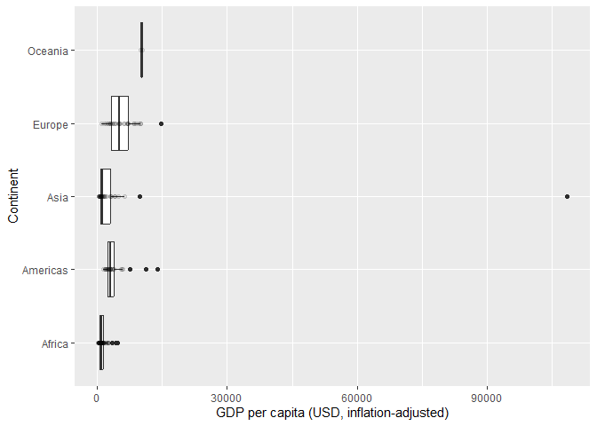
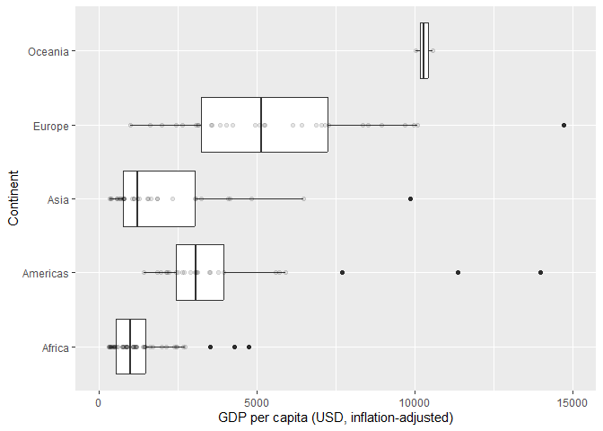
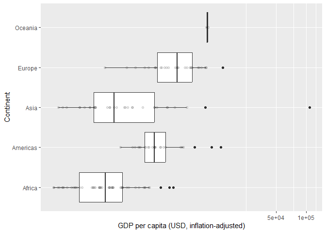
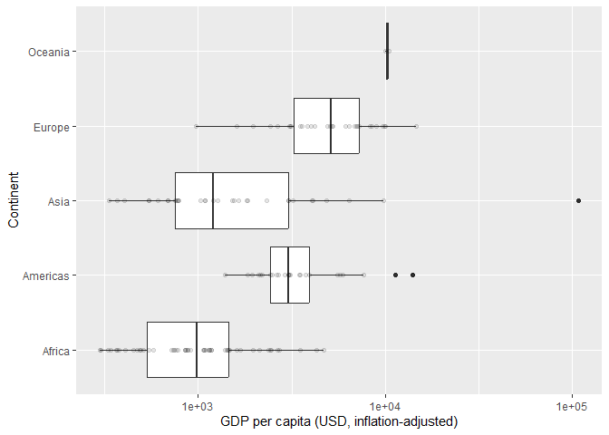
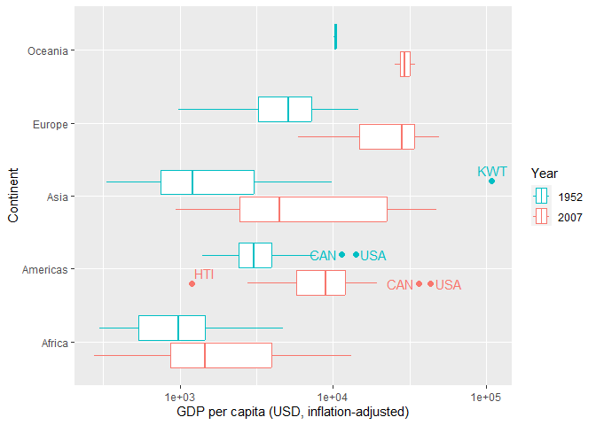
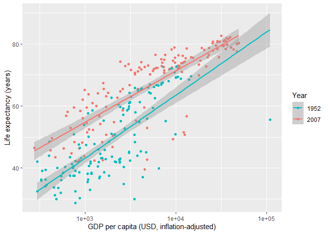
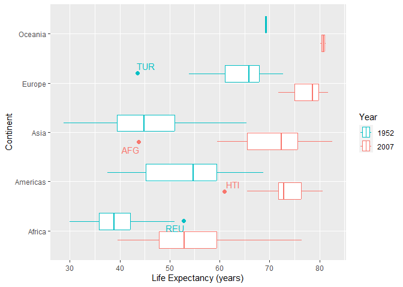
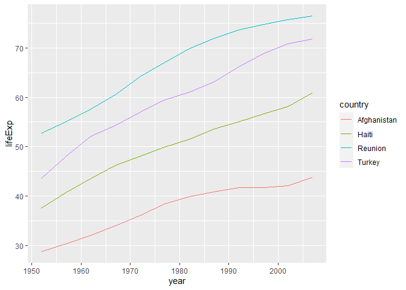

Gapminder
================
Jacob Smilg
2023-02-26

- [Grading Rubric](#grading-rubric)
  - [Individual](#individual)
  - [Due Date](#due-date)
- [Guided EDA](#guided-eda)
  - [**q0** Perform your “first checks” on the dataset. What variables
    are in
    this](#q0-perform-your-first-checks-on-the-dataset-what-variables-are-in-this)
  - [**q1** Determine the most and least recent years in the `gapminder`
    dataset.](#q1-determine-the-most-and-least-recent-years-in-the-gapminder-dataset)
  - [**q2** Filter on years matching `year_min`, and make a plot of the
    GDP per capita against continent. Choose an appropriate `geom_` to
    visualize the data. What observations can you
    make?](#q2-filter-on-years-matching-year_min-and-make-a-plot-of-the-gdp-per-capita-against-continent-choose-an-appropriate-geom_-to-visualize-the-data-what-observations-can-you-make)
  - [**q3** You should have found *at least* three outliers in q2 (but
    possibly many more!). Identify those outliers (figure out which
    countries they
    are).](#q3-you-should-have-found-at-least-three-outliers-in-q2-but-possibly-many-more-identify-those-outliers-figure-out-which-countries-they-are)
  - [**q4** Create a plot similar to yours from q2 studying both
    `year_min` and `year_max`. Find a way to highlight the outliers from
    q3 on your plot *in a way that lets you identify which country is
    which*. Compare the patterns between `year_min` and
    `year_max`.](#q4-create-a-plot-similar-to-yours-from-q2-studying-both-year_min-and-year_max-find-a-way-to-highlight-the-outliers-from-q3-on-your-plot-in-a-way-that-lets-you-identify-which-country-is-which-compare-the-patterns-between-year_min-and-year_max)
- [Your Own EDA](#your-own-eda)
  - [**q5** Create *at least* three new figures below. With each figure,
    try to pose new questions about the
    data.](#q5-create-at-least-three-new-figures-below-with-each-figure-try-to-pose-new-questions-about-the-data)

*Purpose*: Learning to do EDA well takes practice! In this challenge
you’ll further practice EDA by first completing a guided exploration,
then by conducting your own investigation. This challenge will also give
you a chance to use the wide variety of visual tools we’ve been
learning.

<!-- include-rubric -->

# Grading Rubric

<!-- -------------------------------------------------- -->

Unlike exercises, **challenges will be graded**. The following rubrics
define how you will be graded, both on an individual and team basis.

## Individual

<!-- ------------------------- -->

| Category    | Needs Improvement                                                                                                | Satisfactory                                                                                                               |
|-------------|------------------------------------------------------------------------------------------------------------------|----------------------------------------------------------------------------------------------------------------------------|
| Effort      | Some task **q**’s left unattempted                                                                               | All task **q**’s attempted                                                                                                 |
| Observed    | Did not document observations, or observations incorrect                                                         | Documented correct observations based on analysis                                                                          |
| Supported   | Some observations not clearly supported by analysis                                                              | All observations clearly supported by analysis (table, graph, etc.)                                                        |
| Assessed    | Observations include claims not supported by the data, or reflect a level of certainty not warranted by the data | Observations are appropriately qualified by the quality & relevance of the data and (in)conclusiveness of the support      |
| Specified   | Uses the phrase “more data are necessary” without clarification                                                  | Any statement that “more data are necessary” specifies which *specific* data are needed to answer what *specific* question |
| Code Styled | Violations of the [style guide](https://style.tidyverse.org/) hinder readability                                 | Code sufficiently close to the [style guide](https://style.tidyverse.org/)                                                 |

## Due Date

<!-- ------------------------- -->

All the deliverables stated in the rubrics above are due **at midnight**
before the day of the class discussion of the challenge. See the
[Syllabus](https://docs.google.com/document/d/1qeP6DUS8Djq_A0HMllMqsSqX3a9dbcx1/edit?usp=sharing&ouid=110386251748498665069&rtpof=true&sd=true)
for more information.

``` r
library(tidyverse)
```

    ## ── Attaching packages ─────────────────────────────────────── tidyverse 1.3.2 ──
    ## ✔ ggplot2 3.4.0      ✔ purrr   1.0.1 
    ## ✔ tibble  3.1.8      ✔ dplyr   1.0.10
    ## ✔ tidyr   1.2.1      ✔ stringr 1.5.0 
    ## ✔ readr   2.1.3      ✔ forcats 0.5.2 
    ## ── Conflicts ────────────────────────────────────────── tidyverse_conflicts() ──
    ## ✖ dplyr::filter() masks stats::filter()
    ## ✖ dplyr::lag()    masks stats::lag()

``` r
library(gapminder)
library(maps)
```

    ## 
    ## Attaching package: 'maps'
    ## 
    ## The following object is masked from 'package:purrr':
    ## 
    ##     map

*Background*: [Gapminder](https://www.gapminder.org/about-gapminder/) is
an independent organization that seeks to educate people about the state
of the world. They seek to counteract the worldview constructed by a
hype-driven media cycle, and promote a “fact-based worldview” by
focusing on data. The dataset we’ll study in this challenge is from
Gapminder.

# Guided EDA

<!-- -------------------------------------------------- -->

First, we’ll go through a round of *guided EDA*. Try to pay attention to
the high-level process we’re going through—after this guided round
you’ll be responsible for doing another cycle of EDA on your own!

### **q0** Perform your “first checks” on the dataset. What variables are in this

dataset?

``` r
?gapminder
```

    ## starting httpd help server ... done

``` r
glimpse(gapminder)
```

    ## Rows: 1,704
    ## Columns: 6
    ## $ country   <fct> "Afghanistan", "Afghanistan", "Afghanistan", "Afghanistan", …
    ## $ continent <fct> Asia, Asia, Asia, Asia, Asia, Asia, Asia, Asia, Asia, Asia, …
    ## $ year      <int> 1952, 1957, 1962, 1967, 1972, 1977, 1982, 1987, 1992, 1997, …
    ## $ lifeExp   <dbl> 28.801, 30.332, 31.997, 34.020, 36.088, 38.438, 39.854, 40.8…
    ## $ pop       <int> 8425333, 9240934, 10267083, 11537966, 13079460, 14880372, 12…
    ## $ gdpPercap <dbl> 779.4453, 820.8530, 853.1007, 836.1971, 739.9811, 786.1134, …

**Observations**:

- `country`, `continent`, `year`, `lifeExp` (life expectancy), `pop`
  (population), `gdpPercap` (GDP per capita)

### **q1** Determine the most and least recent years in the `gapminder` dataset.

*Hint*: Use the `pull()` function to get a vector out of a tibble.
(Rather than the `$` notation of base R.)

``` r
## TASK: Find the largest and smallest values of `year` in `gapminder`
year_max <- gapminder %>% 
  pull(year) %>% 
  max()
year_min <- gapminder %>% 
  pull(year) %>% 
  min()
```

Use the following test to check your work.

``` r
## NOTE: No need to change this
assertthat::assert_that(year_max %% 7 == 5)
```

    ## [1] TRUE

``` r
assertthat::assert_that(year_max %% 3 == 0)
```

    ## [1] TRUE

``` r
assertthat::assert_that(year_min %% 7 == 6)
```

    ## [1] TRUE

``` r
assertthat::assert_that(year_min %% 3 == 2)
```

    ## [1] TRUE

``` r
if (is_tibble(year_max)) {
  print("year_max is a tibble; try using `pull()` to get a vector")
  assertthat::assert_that(False)
}

print("Nice!")
```

    ## [1] "Nice!"

### **q2** Filter on years matching `year_min`, and make a plot of the GDP per capita against continent. Choose an appropriate `geom_` to visualize the data. What observations can you make?

You may encounter difficulties in visualizing these data; if so document
your challenges and attempt to produce the most informative visual you
can.

``` r
## TASK: Create a visual of gdpPercap vs continent
base_gdp_plot <-
  gapminder %>% 
  filter(year == year_min) %>% 
  ggplot(aes(gdpPercap, continent)) +
  geom_boxplot() +
  geom_point(alpha = 0.1) +
  labs(
    x = "GDP per capita (USD, inflation-adjusted)",
    y = "Continent"
  )

base_gdp_plot
```

<!-- -->

``` r
base_gdp_plot +
  coord_trans(xlim = c(0, 15000))
```

<!-- -->

``` r
base_gdp_plot +
  coord_trans(x = "log")
```

<!-- -->

``` r
base_gdp_plot +
  scale_x_log10()
```

<!-- -->

**Observations**:

- The log scale could be misleading here — as always, it makes things
  seem much closer together than they really are. An easy example to
  pick out here is comparing Oceania’s median to Africa’s; Oceania’s is
  obviously quite a bit larger, but at a glance, the physical proximity
  of the lines obfuscate that Oceania’s median is really about ten times
  larger than Africa’s.
- Oceania’s `gdpPercap`‘s are extremely concentrated slightly above
  \$10000. This is higher than all of the other continents’ 3rd
  quartiles. The bunching may be due to Oceania’s relatively small size
  — fewer, closer together countries probably causes there economies to
  be tied to each-other closely.
- Asia has the widest IQR of the data, which makes sense because of its
  size. Asia likely has some very rich countries, and some very poor
  countries.
- Africa has the country with the lowest `gdpPercap`, but the country
  with the highest `gdpPercap` within Africa is higher than the
  Americas’ 3rd quartile, and is almost as high as Europe’s median.
- The Americas have a relatively small spread, second only to Oceania’s,
  indicating that the countries within have relatively similar
  `gdpPercap`’s.
- Asia has an outlier that is extremely far above any continent’s
  highest `gdpPercap` at just above \$100000 (approximately ten times
  Oceania’s median!)

**Difficulties & Approaches**:

- I’m initially trying to use a box plot, but there is an outlier in
  `gdpPercap` for Asia that makes it difficult to see the rest of the
  data. I’m going to approach this by using a log scale on the x axis,
  which I hope is okay to do on a box plot — I’ll try it and see what
  happens.
- The log scale helped a lot and doesn’t seem to distort things in a
  harmful way, but there are very few labels on the x axis below the
  5e04 tick. I’m going to investigate this online.
- My investigation led me to `scale_x_log10()`, which is a different way
  of getting a logarithmic scale. The difference seems to be that scale
  transformation (e.g. `scale_x_log10()`) occurs before statistics are
  calculated, and coordinate transformation
  (e.g. `coord_trans(x = "log")`) happens afterwards. This causes the
  geometries generated using the approaches to differ, though in this
  case it only really effects the whiskers, and not by very much. Since
  I’m also using `geom_point(alpha = 0.1)`, you can still see what’s
  going on. (also, based on the next question, it’s probably fine since
  there are still three distinct outliers displayed.)
  - The `scale_x_log10()` approach also fixes the tick mark issue, so
    I’ll stick with that plot.

### **q3** You should have found *at least* three outliers in q2 (but possibly many more!). Identify those outliers (figure out which countries they are).

``` r
## TASK: Identify the outliers from q2
gdppercap_high_outliers <- 
  gapminder %>% 
  filter(year == year_min) %>% 
  group_by(continent) %>% 
  filter(log10(gdpPercap) > quantile(log10(gdpPercap), 0.75) + 1.5 * IQR(log10(gdpPercap)))

gdppercap_high_outliers
```

    ## # A tibble: 3 × 6
    ## # Groups:   continent [2]
    ##   country       continent  year lifeExp       pop gdpPercap
    ##   <fct>         <fct>     <int>   <dbl>     <int>     <dbl>
    ## 1 Canada        Americas   1952    68.8  14785584    11367.
    ## 2 Kuwait        Asia       1952    55.6    160000   108382.
    ## 3 United States Americas   1952    68.4 157553000    13990.

**Observations**:

- Identify the outlier countries from q2
  - The outlier countries from q2 are Canada, Kuwait, and the United
    States.
    - I somewhat expected Canada and the US, but Kuwait is a surprise to
      me.

    - Kuwait has a ***much*** smaller population than Canada (~100x
      smaller) and the US (~1000x smaller)

    - Kuwait’s life expectancy is about 13 years shorter than the US and
      Canada, which is odd; I would expect `gdpPercap` to have a
      positive relationship with `lifeExp`. I wonder if outliers in the
      computation of `lifeExp` or `gdpPercap` are skewing this data.

*Hint*: For the next task, it’s helpful to know a ggplot trick we’ll
learn in an upcoming exercise: You can use the `data` argument inside
any `geom_*` to modify the data that will be plotted *by that geom
only*. For instance, you can use this trick to filter a set of points to
label:

``` r
## NOTE: No need to edit, use ideas from this in q4 below
gapminder %>%
  filter(year == max(year)) %>%

  ggplot(aes(continent, lifeExp)) +
  geom_boxplot() +
  geom_point(
    data = . %>% filter(country %in% c("United Kingdom", "Japan", "Zambia")),
    mapping = aes(color = country),
    size = 2
  )
```

<!-- -->

### **q4** Create a plot similar to yours from q2 studying both `year_min` and `year_max`. Find a way to highlight the outliers from q3 on your plot *in a way that lets you identify which country is which*. Compare the patterns between `year_min` and `year_max`.

*Hint*: We’ve learned a lot of different ways to show multiple
variables; think about using different aesthetics or facets.

``` r
## TASK: Create a visual of gdpPercap vs continent
library(ggrepel)

gap_with_colors_codes <-
  gapminder %>%
  mutate(
    country_color = country_colors[country],
    factor_year = factor(year, levels = sort(unique(year), decreasing = TRUE)) # for ordering things in the plot correctly
    ) %>%
  left_join(select(country_codes, country, iso_alpha), by = "country") %>%
  rename(country_code = iso_alpha)

gdppercap_outliers <- 
  gap_with_colors_codes %>% 
  filter(year == year_min | year == year_max) %>% 
  group_by(year, continent) %>% 
  filter(
    log10(gdpPercap) > quantile(log10(gdpPercap), 0.75) + 1.5 * IQR(log10(gdpPercap)) | # high outliers
      log10(gdpPercap) < quantile(log10(gdpPercap), 0.25) - 1.5 * IQR(log10(gdpPercap))) # low outliers

gdppercap_outliers
```

    ## # A tibble: 6 × 9
    ## # Groups:   year, continent [3]
    ##   country       continent  year lifeExp      pop gdpPe…¹ count…² facto…³ count…⁴
    ##   <chr>         <fct>     <int>   <dbl>    <int>   <dbl> <chr>   <fct>   <chr>  
    ## 1 Canada        Americas   1952    68.8   1.48e7  11367. #CC6F0D 1952    CAN    
    ## 2 Canada        Americas   2007    80.7   3.34e7  36319. #CC6F0D 2007    CAN    
    ## 3 Haiti         Americas   2007    60.9   8.50e6   1202. #AD0826 2007    HTI    
    ## 4 Kuwait        Asia       1952    55.6   1.6 e5 108382. #FDB668 1952    KWT    
    ## 5 United States Americas   1952    68.4   1.58e8  13990. #C6E79C 1952    USA    
    ## 6 United States Americas   2007    78.2   3.01e8  42952. #C6E79C 2007    USA    
    ## # … with abbreviated variable names ¹​gdpPercap, ²​country_color, ³​factor_year,
    ## #   ⁴​country_code

``` r
gap_with_colors_codes %>% 
  filter(year == year_min | year == year_max) %>% 
  ggplot(aes(gdpPercap, continent, color = factor_year)) +
  labs(
    x = "GDP per capita (USD, inflation-adjusted)",
    y = "Continent"
  ) +
  geom_boxplot(outlier.shape = NA) +
  geom_point(
    data = gdppercap_outliers %>% filter(year == year_min),
    position = position_nudge(y = 0.2),
    size = 2, show.legend = FALSE
    ) +
  geom_text_repel(
    data = gdppercap_outliers %>% filter(year == year_min),
    aes(label = country_code),
    position = position_nudge(y = 0.2), direction = "both", seed = 2, show.legend = FALSE
    ) +
  geom_point(
    data = gdppercap_outliers %>% filter(year == year_max),
    position = position_nudge(y = -0.2),
    size = 2, show.legend = FALSE
    ) +
  geom_text_repel(
    data = gdppercap_outliers %>% filter(year == year_max),
    aes(label = country_code),
    position = position_nudge(y = -0.2), direction = "both", seed = 2, show.legend = FALSE
    ) +
  scale_x_log10() +
  guides(color = guide_legend("Year", reverse = TRUE))
```

<!-- -->

**Observations**:

- The outliers are different in 2007 — Kuwait is no longer an outlier,
  and Haiti is an outlier.
- Haiti is a low outlier as opposed to a high one (like USA and CAN).
  The appearance of Haiti as a low outlier in 2007 suggests something
  (very) bad happened to their economy in between 1952 and 2007. My best
  (relatively uneducated) guess about what happened is a combination of
  natural disasters and political turmoil.
- The IQR for each continent increases from 1952 to 2007, suggesting
  that wealth inequality between countries increased.
- The entirety of the box and whiskers for each continent increased from
  1952-2007, excluding the low whisker for Africa, which decreased
  slightly. This suggests a general worldwide increase in per-capita
  GDP.
  - Most of the new ranges overlap with the old ones, except for
    Oceania’s which isn’t even close to overlapping.

# Your Own EDA

<!-- -------------------------------------------------- -->

Now it’s your turn! We just went through guided EDA considering the GDP
per capita at two time points. You can continue looking at outliers,
consider different years, repeat the exercise with `lifeExp`, consider
the relationship between variables, or something else entirely.

### **q5** Create *at least* three new figures below. With each figure, try to pose new questions about the data.

``` r
## TASK: Your first graph
gap_with_colors_codes %>% 
  filter(year == year_min | year == year_max) %>% 
  ggplot(aes(gdpPercap, lifeExp, group = factor_year, color = factor_year)) +
  geom_point() +
  geom_smooth(method = "lm") +
  scale_x_log10() +
  labs(
    x = "GDP per capita (USD, inflation-adjusted)",
    y = "Life expectancy (years)"
  ) +
  guides(color = guide_legend("Year", reverse = TRUE))
```

    ## `geom_smooth()` using formula = 'y ~ x'

<!-- -->

- The above figure is `lifeExp` vs `gdpPercap` for the years 1952 and
  2007 plotted on a semilog x scale, along with a linear fit to the
  data.
- There is a positive trend between life expectancy and GDP per capita
  for 1952 and 2007.
- The slope of the linear model is steeper in 2007.

``` r
lifeexp_outliers <- 
  gap_with_colors_codes %>% 
  filter(year == year_min | year == year_max) %>% 
  group_by(year, continent) %>% 
  filter(
    lifeExp > quantile(lifeExp, 0.75) + 1.5 * IQR(lifeExp) | # high outliers
      lifeExp < quantile(lifeExp, 0.25) - 1.5 * IQR(lifeExp)) # low outliers

lifeexp_outliers
```

    ## # A tibble: 4 × 9
    ## # Groups:   year, continent [4]
    ##   country     continent  year lifeExp      pop gdpPercap count…¹ facto…² count…³
    ##   <chr>       <fct>     <int>   <dbl>    <int>     <dbl> <chr>   <fct>   <chr>  
    ## 1 Afghanistan Asia       2007    43.8 31889923      975. #7F3B08 2007    AFG    
    ## 2 Haiti       Americas   2007    60.9  8502814     1202. #AD0826 2007    HTI    
    ## 3 Reunion     Africa     1952    52.7   257700     2719. #D4BCDB 1952    REU    
    ## 4 Turkey      Europe     1952    43.6 22235677     1969. #B2DD7E 1952    TUR    
    ## # … with abbreviated variable names ¹​country_color, ²​factor_year, ³​country_code

``` r
gap_with_colors_codes %>% 
  filter(year == year_min | year == year_max) %>% 
  ggplot(aes(lifeExp, continent, color = factor_year)) +
  labs(
    x = "Life Expectancy (years)",
    y = "Continent"
  ) +
  geom_boxplot(outlier.shape = NA) +
  geom_point(
    data = lifeexp_outliers %>% filter(year == year_min),
    position = position_nudge(y = 0.2),
    size = 2, show.legend = FALSE
    ) +
  geom_text_repel(
    data = lifeexp_outliers %>% filter(year == year_min),
    aes(label = country_code),
    position = position_nudge(y = 0.2), direction = "both", seed = 2, show.legend = FALSE
    ) +
  geom_point(
    data = lifeexp_outliers %>% filter(year == year_max),
    position = position_nudge(y = -0.2),
    size = 2, show.legend = FALSE
    ) +
  geom_text_repel(
    data = lifeexp_outliers %>% filter(year == year_max),
    aes(label = country_code),
    position = position_nudge(y = -0.2), direction = "both", seed = 2, show.legend = FALSE
    ) +
  guides(color = guide_legend("Year", reverse = TRUE))
```

<!-- -->

- The above plot is similar to my q4 plot, but with life expectancy
  instead of GDP.
- Life expectancy increased significantly across the board between 1952
  and 2007.

``` r
## TASK: Your third graph
gap_with_colors_codes %>% 
  filter(country_code %in% lifeexp_outliers$country_code) %>% 
  ggplot(aes(year, lifeExp, color = country)) +
  geom_line()
```

<!-- -->

- The above plot shows life expectancy over time for the outliers in the
  previous plot.
- Life expectancy still increased for each of the outliers, even though
  their values aren’t close to being on par with the other countries in
  their continents.
