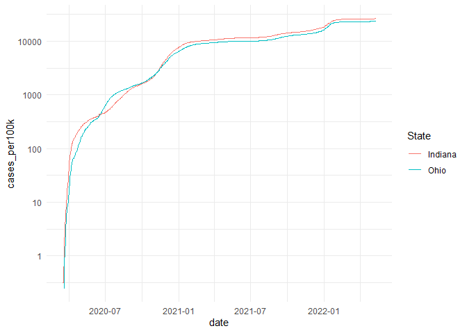

COVID-19
================
Jacob Smilg
2023-03-19

- [Grading Rubric](#grading-rubric)
  - [Individual](#individual)
  - [Due Date](#due-date)
- [The Big Picture](#the-big-picture)
- [Get the Data](#get-the-data)
  - [Navigating the Census Bureau](#navigating-the-census-bureau)
    - [**q1** Load Table `B01003` into the following tibble. Make sure
      the column names are
      `id, Geographic Area Name, Estimate!!Total, Margin of Error!!Total`.](#q1-load-table-b01003-into-the-following-tibble-make-sure-the-column-names-are-id-geographic-area-name-estimatetotal-margin-of-errortotal)
  - [Automated Download of NYT Data](#automated-download-of-nyt-data)
    - [**q2** Visit the NYT GitHub repo and find the URL for the **raw**
      US County-level data. Assign that URL as a string to the variable
      below.](#q2-visit-the-nyt-github-repo-and-find-the-url-for-the-raw-us-county-level-data-assign-that-url-as-a-string-to-the-variable-below)
- [Join the Data](#join-the-data)
  - [**q3** Process the `id` column of `df_pop` to create a `fips`
    column.](#q3-process-the-id-column-of-df_pop-to-create-a-fips-column)
  - [**q4** Join `df_covid` with `df_q3` by the `fips` column. Use the
    proper type of join to preserve *only* the rows in
    `df_covid`.](#q4-join-df_covid-with-df_q3-by-the-fips-column-use-the-proper-type-of-join-to-preserve-only-the-rows-in-df_covid)
- [Analyze](#analyze)
  - [Normalize](#normalize)
    - [**q5** Use the `population` estimates in `df_data` to normalize
      `cases` and `deaths` to produce per 100,000 counts \[3\]. Store
      these values in the columns `cases_per100k` and
      `deaths_per100k`.](#q5-use-the-population-estimates-in-df_data-to-normalize-cases-and-deaths-to-produce-per-100000-counts-3-store-these-values-in-the-columns-cases_per100k-and-deaths_per100k)
  - [Guided EDA](#guided-eda)
    - [**q6** Compute the mean and standard deviation for
      `cases_per100k` and
      `deaths_per100k`.](#q6-compute-the-mean-and-standard-deviation-for-cases_per100k-and-deaths_per100k)
    - [**q7** Find the top 10 counties in terms of `cases_per100k`, and
      the top 10 in terms of `deaths_per100k`. Report the population of
      each county along with the per-100,000 counts. Compare the counts
      against the mean values you found in q6. Note any
      observations.](#q7-find-the-top-10-counties-in-terms-of-cases_per100k-and-the-top-10-in-terms-of-deaths_per100k-report-the-population-of-each-county-along-with-the-per-100000-counts-compare-the-counts-against-the-mean-values-you-found-in-q6-note-any-observations)
  - [Self-directed EDA](#self-directed-eda)
    - [**q8** Drive your own ship: You’ve just put together a very rich
      dataset; you now get to explore! Pick your own direction and
      generate at least one punchline figure to document an interesting
      finding. I give a couple tips & ideas
      below:](#q8-drive-your-own-ship-youve-just-put-together-a-very-rich-dataset-you-now-get-to-explore-pick-your-own-direction-and-generate-at-least-one-punchline-figure-to-document-an-interesting-finding-i-give-a-couple-tips--ideas-below)
    - [Ideas](#ideas)
    - [Aside: Some visualization
      tricks](#aside-some-visualization-tricks)
    - [Geographic exceptions](#geographic-exceptions)
- [Notes](#notes)

*Purpose*: In this challenge, you’ll learn how to navigate the U.S.
Census Bureau website, programmatically download data from the internet,
and perform a county-level population-weighted analysis of current
COVID-19 trends. This will give you the base for a very deep
investigation of COVID-19, which we’ll build upon for Project 1.

<!-- include-rubric -->

# Grading Rubric

<!-- -------------------------------------------------- -->

Unlike exercises, **challenges will be graded**. The following rubrics
define how you will be graded, both on an individual and team basis.

## Individual

<!-- ------------------------- -->

| Category    | Needs Improvement                                                                                                | Satisfactory                                                                                                               |
|-------------|------------------------------------------------------------------------------------------------------------------|----------------------------------------------------------------------------------------------------------------------------|
| Effort      | Some task **q**’s left unattempted                                                                               | All task **q**’s attempted                                                                                                 |
| Observed    | Did not document observations, or observations incorrect                                                         | Documented correct observations based on analysis                                                                          |
| Supported   | Some observations not clearly supported by analysis                                                              | All observations clearly supported by analysis (table, graph, etc.)                                                        |
| Assessed    | Observations include claims not supported by the data, or reflect a level of certainty not warranted by the data | Observations are appropriately qualified by the quality & relevance of the data and (in)conclusiveness of the support      |
| Specified   | Uses the phrase “more data are necessary” without clarification                                                  | Any statement that “more data are necessary” specifies which *specific* data are needed to answer what *specific* question |
| Code Styled | Violations of the [style guide](https://style.tidyverse.org/) hinder readability                                 | Code sufficiently close to the [style guide](https://style.tidyverse.org/)                                                 |

## Due Date

<!-- ------------------------- -->

All the deliverables stated in the rubrics above are due **at midnight**
before the day of the class discussion of the challenge. See the
[Syllabus](https://docs.google.com/document/d/1qeP6DUS8Djq_A0HMllMqsSqX3a9dbcx1/edit?usp=sharing&ouid=110386251748498665069&rtpof=true&sd=true)
for more information.

``` r
library(tidyverse)
```

    ## ── Attaching packages ─────────────────────────────────────── tidyverse 1.3.2 ──
    ## ✔ ggplot2 3.4.0      ✔ purrr   1.0.1 
    ## ✔ tibble  3.1.8      ✔ dplyr   1.0.10
    ## ✔ tidyr   1.2.1      ✔ stringr 1.5.0 
    ## ✔ readr   2.1.3      ✔ forcats 0.5.2 
    ## ── Conflicts ────────────────────────────────────────── tidyverse_conflicts() ──
    ## ✖ dplyr::filter() masks stats::filter()
    ## ✖ dplyr::lag()    masks stats::lag()

*Background*:
[COVID-19](https://en.wikipedia.org/wiki/Coronavirus_disease_2019) is
the disease caused by the virus SARS-CoV-2. In 2020 it became a global
pandemic, leading to huge loss of life and tremendous disruption to
society. The New York Times (as of writing) publishes up-to-date data on
the progression of the pandemic across the United States—we will study
these data in this challenge.

*Optional Readings*: I’ve found this [ProPublica
piece](https://www.propublica.org/article/how-to-understand-covid-19-numbers)
on “How to understand COVID-19 numbers” to be very informative!

# The Big Picture

<!-- -------------------------------------------------- -->

We’re about to go through *a lot* of weird steps, so let’s first fix the
big picture firmly in mind:

We want to study COVID-19 in terms of data: both case counts (number of
infections) and deaths. We’re going to do a county-level analysis in
order to get a high-resolution view of the pandemic. Since US counties
can vary widely in terms of their population, we’ll need population
estimates in order to compute infection rates (think back to the
`Titanic` challenge).

That’s the high-level view; now let’s dig into the details.

# Get the Data

<!-- -------------------------------------------------- -->

1.  County-level population estimates (Census Bureau)
2.  County-level COVID-19 counts (New York Times)

## Navigating the Census Bureau

<!-- ------------------------- -->

**Steps**: Our objective is to find the 2018 American Community
Survey\[1\] (ACS) Total Population estimates, disaggregated by counties.
To check your results, this is Table `B01003`.

1.  Go to [data.census.gov](data.census.gov).
2.  Scroll down and click `View Tables`.
3.  Apply filters to find the ACS **Total Population** estimates,
    disaggregated by counties. I used the filters:

- `Topics > Populations and People > Counts, Estimates, and Projections > Population Total`
- `Geography > County > All counties in United States`

5.  Select the **Total Population** table and click the `Download`
    button to download the data; make sure to select the 2018 5-year
    estimates.
6.  Unzip and move the data to your `challenges/data` folder.

- Note that the data will have a crazy-long filename like
  `ACSDT5Y2018.B01003_data_with_overlays_2020-07-26T094857.csv`. That’s
  because metadata is stored in the filename, such as the year of the
  estimate (`Y2018`) and my access date (`2020-07-26`). **Your filename
  will vary based on when you download the data**, so make sure to copy
  the filename that corresponds to what you downloaded!

### **q1** Load Table `B01003` into the following tibble. Make sure the column names are `id, Geographic Area Name, Estimate!!Total, Margin of Error!!Total`.

*Hint*: You will need to use the `skip` keyword when loading these data!

``` r
## TASK: Load the census bureau data with the following tibble name.
df_pop <- read_csv(
  "./data/ACSDT5Y2018.B01003-Data.csv",
  skip = 2,
  col_names = c(
    "id",
    "Geographic Area Name",
    "Estimate!!Total",
    "Annotation of Estimate!!Total",
    "Margin of Error!!Total",
    "Annotation of Margin of Error!!Total"
    )
  ) %>% 
  select(-c(starts_with("Annotation"), "X7"))
```

    ## Rows: 3220 Columns: 7
    ## ── Column specification ────────────────────────────────────────────────────────
    ## Delimiter: ","
    ## chr (5): id, Geographic Area Name, Annotation of Estimate!!Total, Margin of ...
    ## dbl (1): Estimate!!Total
    ## lgl (1): X7
    ## 
    ## ℹ Use `spec()` to retrieve the full column specification for this data.
    ## ℹ Specify the column types or set `show_col_types = FALSE` to quiet this message.

*Note*: You can find information on 1-year, 3-year, and 5-year estimates
[here](https://www.census.gov/programs-surveys/acs/guidance/estimates.html).
The punchline is that 5-year estimates are more reliable but less
current.

## Automated Download of NYT Data

<!-- ------------------------- -->

ACS 5-year estimates don’t change all that often, but the COVID-19 data
are changing rapidly. To that end, it would be nice to be able to
*programmatically* download the most recent data for analysis; that way
we can update our analysis whenever we want simply by re-running our
notebook. This next problem will have you set up such a pipeline.

The New York Times is publishing up-to-date data on COVID-19 on
[GitHub](https://github.com/nytimes/covid-19-data).

### **q2** Visit the NYT [GitHub](https://github.com/nytimes/covid-19-data) repo and find the URL for the **raw** US County-level data. Assign that URL as a string to the variable below.

``` r
## TASK: Find the URL for the NYT covid-19 county-level data
url_counties <- "https://raw.githubusercontent.com/nytimes/covid-19-data/master/us-counties.csv"
```

Once you have the url, the following code will download a local copy of
the data, then load the data into R.

``` r
## NOTE: No need to change this; just execute
## Set the filename of the data to download
filename_nyt <- "./data/nyt_counties.csv"

## Download the data locally
curl::curl_download(
        url_counties,
        destfile = filename_nyt
      )

## Loads the downloaded csv
df_covid <- read_csv(filename_nyt)
```

    ## Rows: 2502832 Columns: 6
    ## ── Column specification ────────────────────────────────────────────────────────
    ## Delimiter: ","
    ## chr  (3): county, state, fips
    ## dbl  (2): cases, deaths
    ## date (1): date
    ## 
    ## ℹ Use `spec()` to retrieve the full column specification for this data.
    ## ℹ Specify the column types or set `show_col_types = FALSE` to quiet this message.

You can now re-run the chunk above (or the entire notebook) to pull the
most recent version of the data. Thus you can periodically re-run this
notebook to check in on the pandemic as it evolves.

*Note*: You should feel free to copy-paste the code above for your own
future projects!

# Join the Data

<!-- -------------------------------------------------- -->

To get a sense of our task, let’s take a glimpse at our two data
sources.

``` r
## NOTE: No need to change this; just execute
df_pop %>% glimpse
```

    ## Rows: 3,220
    ## Columns: 4
    ## $ id                       <chr> "0500000US01001", "0500000US01003", "0500000U…
    ## $ `Geographic Area Name`   <chr> "Autauga County, Alabama", "Baldwin County, A…
    ## $ `Estimate!!Total`        <dbl> 55200, 208107, 25782, 22527, 57645, 10352, 20…
    ## $ `Margin of Error!!Total` <chr> "*****", "*****", "*****", "*****", "*****", …

``` r
df_covid %>% glimpse
```

    ## Rows: 2,502,832
    ## Columns: 6
    ## $ date   <date> 2020-01-21, 2020-01-22, 2020-01-23, 2020-01-24, 2020-01-24, 20…
    ## $ county <chr> "Snohomish", "Snohomish", "Snohomish", "Cook", "Snohomish", "Or…
    ## $ state  <chr> "Washington", "Washington", "Washington", "Illinois", "Washingt…
    ## $ fips   <chr> "53061", "53061", "53061", "17031", "53061", "06059", "17031", …
    ## $ cases  <dbl> 1, 1, 1, 1, 1, 1, 1, 1, 1, 1, 1, 1, 1, 1, 1, 1, 1, 1, 1, 1, 1, …
    ## $ deaths <dbl> 0, 0, 0, 0, 0, 0, 0, 0, 0, 0, 0, 0, 0, 0, 0, 0, 0, 0, 0, 0, 0, …

To join these datasets, we’ll need to use [FIPS county
codes](https://en.wikipedia.org/wiki/FIPS_county_code).\[2\] The last
`5` digits of the `id` column in `df_pop` is the FIPS county code, while
the NYT data `df_covid` already contains the `fips`.

### **q3** Process the `id` column of `df_pop` to create a `fips` column.

``` r
## TASK: Create a `fips` column by extracting the county code
df_q3 <- 
  df_pop %>% 
  mutate(fips = str_sub(id, -5))
```

Use the following test to check your answer.

``` r
## NOTE: No need to change this
## Check known county
assertthat::assert_that(
              (df_q3 %>%
              filter(str_detect(`Geographic Area Name`, "Autauga County")) %>%
              pull(fips)) == "01001"
            )
```

    ## [1] TRUE

``` r
print("Very good!")
```

    ## [1] "Very good!"

### **q4** Join `df_covid` with `df_q3` by the `fips` column. Use the proper type of join to preserve *only* the rows in `df_covid`.

``` r
## TASK: Join df_covid and df_q3 by fips.
df_q4 <-
  df_covid %>% left_join(df_q3, by = "fips")
```

For convenience, I down-select some columns and produce more convenient
column names.

``` r
## NOTE: No need to change; run this to produce a more convenient tibble
df_data <-
  df_q4 %>%
  select(
    date,
    county,
    state,
    fips,
    cases,
    deaths,
    population = `Estimate!!Total`
  )
```

# Analyze

<!-- -------------------------------------------------- -->

Now that we’ve done the hard work of loading and wrangling the data, we
can finally start our analysis. Our first step will be to produce county
population-normalized cases and death counts. Then we will explore the
data.

## Normalize

<!-- ------------------------- -->

### **q5** Use the `population` estimates in `df_data` to normalize `cases` and `deaths` to produce per 100,000 counts \[3\]. Store these values in the columns `cases_per100k` and `deaths_per100k`.

``` r
## TASK: Normalize cases and deaths
df_normalized <-
  df_data %>% 
  mutate(
    cases_per100k = cases / population * 1e5,
    deaths_per100k = deaths / population * 1e5
  )
```

You may use the following test to check your work.

``` r
## NOTE: No need to change this
## Check known county data
if (any(df_normalized %>% pull(date) %>% str_detect(., "2020-01-21"))) {
  assertthat::assert_that(TRUE)
} else {
  print(str_c(
    "Date 2020-01-21 not found; did you download the historical data (correct),",
    "or just the most recent data (incorrect)?",
    sep = " "
  ))
  assertthat::assert_that(FALSE)
}
```

    ## [1] TRUE

``` r
assertthat::assert_that(
              abs(df_normalized %>%
               filter(
                 str_detect(county, "Snohomish"),
                 date == "2020-01-21"
               ) %>%
              pull(cases_per100k) - 0.127) < 1e-3
            )
```

    ## [1] TRUE

``` r
assertthat::assert_that(
              abs(df_normalized %>%
               filter(
                 str_detect(county, "Snohomish"),
                 date == "2020-01-21"
               ) %>%
              pull(deaths_per100k) - 0) < 1e-3
            )
```

    ## [1] TRUE

``` r
print("Excellent!")
```

    ## [1] "Excellent!"

## Guided EDA

<!-- ------------------------- -->

Before turning you loose, let’s complete a couple guided EDA tasks.

### **q6** Compute the mean and standard deviation for `cases_per100k` and `deaths_per100k`.

``` r
# get the last date in the data
last_date <-
  df_normalized %>% 
  filter(str_detect(county, "Snohomish")) %>% 
  mutate(
    num_date = as.Date(.$date) %>%
      format("%Y%m%d") %>% 
      as.numeric()
    ) %>% 
  select(num_date) %>% 
  max() %>%
  as.character() %>% 
  as.Date("%Y%m%d")

# make sure the most recent date is actually present for all the counties
df_normalized %>%
  # bind_rows(tribble(~date, ~county, as.Date("2020-01-01"), "test")) %>% 
  group_by(county) %>% 
  mutate(last_date_present = as.integer(last_date %in% date)) %>%
  {0 %in% .$last_date_present} # should return false
```

    ## [1] FALSE

``` r
print("Means:")
```

    ## [1] "Means:"

``` r
df_normalized %>% 
  select(cases_per100k, deaths_per100k) %>% 
  colMeans(na.rm = TRUE)
```

    ##  cases_per100k deaths_per100k 
    ##      9974.6748       174.3095

``` r
print("Standard devs:")
```

    ## [1] "Standard devs:"

``` r
df_normalized %>% 
  select(cases_per100k, deaths_per100k) %>% 
  sapply(sd, na.rm = TRUE)
```

    ##  cases_per100k deaths_per100k 
    ##      8448.6587       158.9641

The following chunk computes the mean and standard deviation using only
the most recent case and death per 100k values.

``` r
print("Means:")
```

    ## [1] "Means:"

``` r
df_normalized %>%
  filter(date == last_date) %>%
  select(cases_per100k, deaths_per100k) %>%
  colMeans(na.rm = TRUE)
```

    ##  cases_per100k deaths_per100k 
    ##     24773.9814       375.1242

``` r
print("Standard devs:")
```

    ## [1] "Standard devs:"

``` r
df_normalized %>%
  filter(date == last_date) %>%
  select(cases_per100k, deaths_per100k) %>%
  sapply(sd, na.rm = TRUE)
```

    ##  cases_per100k deaths_per100k 
    ##      6232.7887       159.7369

### **q7** Find the top 10 counties in terms of `cases_per100k`, and the top 10 in terms of `deaths_per100k`. Report the population of each county along with the per-100,000 counts. Compare the counts against the mean values you found in q6. Note any observations.

``` r
## TASK: Find the top 10 max cases_per100k counties; report populations as well
df_normalized %>% 
  filter(date == last_date) %>% 
  select(county, population, cases_per100k) %>% 
  arrange(desc(cases_per100k)) %>% 
  head(10)
```

    ## # A tibble: 10 × 3
    ##    county                   population cases_per100k
    ##    <chr>                         <dbl>         <dbl>
    ##  1 Loving                          102       192157.
    ##  2 Chattahoochee                 10767        69527.
    ##  3 Nome Census Area               9925        62922.
    ##  4 Northwest Arctic Borough       7734        62542.
    ##  5 Crowley                        5630        59449.
    ##  6 Bethel Census Area            18040        57439.
    ##  7 Dewey                          5779        54317.
    ##  8 Dimmit                        10663        54019.
    ##  9 Jim Hogg                       5282        50133.
    ## 10 Kusilvak Census Area           8198        49817.

``` r
## TASK: Find the top 10 deaths_per100k counties; report populations as well
df_normalized %>%
  filter(date == last_date) %>%
  select(county, population, deaths_per100k) %>%
  arrange(desc(deaths_per100k)) %>% 
  head(10)
```

    ## # A tibble: 10 × 3
    ##    county            population deaths_per100k
    ##    <chr>                  <dbl>          <dbl>
    ##  1 McMullen                 662          1360.
    ##  2 Galax city              6638          1175.
    ##  3 Motley                  1156          1125.
    ##  4 Hancock                 8535          1054.
    ##  5 Emporia city            5381          1022.
    ##  6 Towns                  11417          1016.
    ##  7 Jerauld                 2029           986.
    ##  8 Loving                   102           980.
    ##  9 Robertson               2143           980.
    ## 10 Martinsville city      13101           946.

``` r
# this wasn't asked for, but I'm curious about the average population of each county
print("Mean population:")
```

    ## [1] "Mean population:"

``` r
df_normalized %>% 
  filter(date == last_date) %>% 
  pull(population) %>% 
  summary()
```

    ##     Min.  1st Qu.   Median     Mean  3rd Qu.     Max.     NA's 
    ##       75    11226    25909    98985    66384 10098052       47

**Observations**:

| Stat                    | cases_per100k | deaths_per100k |
|-------------------------|---------------|----------------|
| Mean (all data)         | 9974.6748     | 174.3095       |
| Standard Dev (all data) | 8448.6587     | 158.9641       |
| Mean (last day)         | 24773.9814    | 375.1242       |
| Standard Dev (last day) | 6232.7887     | 159.7369       |

- I’m using the stats that are based only on the last day for the
  following observations, since using all of the data causes all the
  cumulative numbers for every single day to be rolled together into one
  stat, which I don’t think is that useful (not that the means for the
  whole country are that useful to begin with).

- The means of both cases and populations are much smaller than the top
  ten counties. For deaths, the mean is around 2-4x smaller than the top
  tens, and around 2-3x smaller for cases.

  - Loving county is an exception to this, with an enormous
    `cases_per100k` (almost 3x Chattahoochee, \#2 on the list).

- The standard deviations for both cases and deaths are pretty big. This
  makes sense, given that they are representing the entire country (with
  the varying responses to the pandemic within).

- The top ten counties all have very small populations - almost all of
  them are under 10000. This is probably due to smaller counties having
  most of the community end up getting infected.

## Self-directed EDA

<!-- ------------------------- -->

### **q8** Drive your own ship: You’ve just put together a very rich dataset; you now get to explore! Pick your own direction and generate at least one punchline figure to document an interesting finding. I give a couple tips & ideas below:

### Ideas

<!-- ------------------------- -->

- Look for outliers.
- Try web searching for news stories in some of the outlier counties.
- Investigate relationships between county population and counts.
- Do a deep-dive on counties that are important to you (e.g. where you
  or your family live).
- Fix the *geographic exceptions* noted below to study New York City.
- Your own idea!

**DO YOUR OWN ANALYSIS HERE**

I moved from Hamilton County in Indiana to Hamilton County in Ohio
before 4th grade — it could be interesting to compare the two counties.

``` r
df_normalized %>% 
  filter(date == last_date & county == "Hamilton" & state %in% c("Indiana", "Ohio")) %>% 
  arrange(desc(cases_per100k))
```

    ## # A tibble: 2 × 9
    ##   date       county   state   fips   cases deaths population cases_per…¹ death…²
    ##   <date>     <chr>    <chr>   <chr>  <dbl>  <dbl>      <dbl>       <dbl>   <dbl>
    ## 1 2022-05-13 Hamilton Indiana 18057  83430    661     316095      26394.    209.
    ## 2 2022-05-13 Hamilton Ohio    39061 191030   2069     812037      23525.    255.
    ## # … with abbreviated variable names ¹​cases_per100k, ²​deaths_per100k

Its interesting that the population in Ohio is about 2.5x larger, but
the cases and deaths per 100k are close to each other.

``` r
df_normalized %>% 
  filter(county == "Hamilton" & state %in% c("Indiana", "Ohio")) %>% 
  ggplot(aes(x = date, y = cases_per100k, color = fct_reorder2(state, date, cases_per100k))) +
  geom_line() +
  scale_color_discrete(name = "State") +
  scale_y_log10() +
  theme_minimal()
```

<!-- -->

The lines stay surprisingly close together! This probably indicates that
the states had similar responses (policy-wise) to the pandemic. How do
those compare with the rest of Ohio and Indiana?

**This next one is my “punchline figure”**

``` r
df_normalized %>% 
  filter(county == "Hamilton" & state %in% c("Indiana", "Ohio")) %>% 
  mutate(fullname = paste(county, "County,", state)) %>% 
  ggplot(aes(x = date, y = cases_per100k, color = fct_reorder2(fullname, date, cases_per100k))) +
  geom_line() +
  geom_line(
    data = df_normalized %>% filter(state %in% c("Indiana", "Ohio")),
    mapping = aes(color = county),
    color = "black"
  ) +
  scale_color_discrete(name = "County") +
  scale_y_log10() +
  theme_minimal() +
  geom_line() +
  labs(
    title = "COVID cases per 100K people in Ohio and Indiana",
    x = "Dates",
    y = "Cases per 100K people")
```

<!-- -->

You can’t distinguish between the counties at all, but I sort of like
that in this specific case - it really clearly shows that the Hamilton
counties in Indiana and Ohio are close to the middle of the bunch. To
me, this is an interesting finding! I’ll try to see if deaths works the
same way:

``` r
df_normalized %>% 
  filter(county == "Hamilton" & state %in% c("Indiana", "Ohio")) %>% 
  mutate(fullname = paste(county, "County,", state)) %>% 
  ggplot(aes(x = date, y = deaths_per100k, color = fct_reorder2(fullname, date, deaths_per100k))) +
  geom_line() +
  geom_line(
    data = df_normalized %>% filter(state %in% c("Indiana", "Ohio")),
    mapping = aes(color = county),
    color = "black"
  ) +
  scale_color_discrete(name = "County") +
  scale_y_log10() +
  theme_minimal() +
  geom_line() +
  labs(
    title = "COVID deaths per 100K people in Ohio and Indiana",
    x = "Date",
    y = "Deaths per 100K people")
```

    ## Warning: Transformation introduced infinite values in continuous y-axis
    ## Transformation introduced infinite values in continuous y-axis
    ## Transformation introduced infinite values in continuous y-axis

<!-- -->

The same thing doesn’t really follow for deaths, but it’s pretty close
once the deaths begin to level off.

### Aside: Some visualization tricks

<!-- ------------------------- -->

These data get a little busy, so it’s helpful to know a few `ggplot`
tricks to help with the visualization. Here’s an example focused on
Massachusetts.

``` r
## NOTE: No need to change this; just an example
df_normalized %>%
  filter(state == "Massachusetts") %>%

  ggplot(
    aes(date, cases_per100k, color = fct_reorder2(county, date, cases_per100k))
  ) +
  geom_line() +
  scale_y_log10(labels = scales::label_number_si()) +
  scale_color_discrete(name = "County") +
  theme_minimal() +
  labs(
    x = "Date",
    y = "Cases (per 100,000 persons)"
  )
```

    ## Warning: `label_number_si()` was deprecated in scales 1.2.0.
    ## ℹ Please use the `scale_cut` argument of `label_number()` instead.

    ## Warning: Removed 789 rows containing missing values (`geom_line()`).

<!-- -->

*Tricks*:

- I use `fct_reorder2` to *re-order* the color labels such that the
  color in the legend on the right is ordered the same as the vertical
  order of rightmost points on the curves. This makes it easier to
  reference the legend.
- I manually set the `name` of the color scale in order to avoid
  reporting the `fct_reorder2` call.
- I use `scales::label_number_si` to make the vertical labels more
  readable.
- I use `theme_minimal()` to clean up the theme a bit.
- I use `labs()` to give manual labels.

### Geographic exceptions

<!-- ------------------------- -->

The NYT repo documents some [geographic
exceptions](https://github.com/nytimes/covid-19-data#geographic-exceptions);
the data for New York, Kings, Queens, Bronx and Richmond counties are
consolidated under “New York City” *without* a fips code. Thus the
normalized counts in `df_normalized` are `NA`. To fix this, you would
need to merge the population data from the New York City counties, and
manually normalize the data.

# Notes

<!-- -------------------------------------------------- -->

\[1\] The census used to have many, many questions, but the ACS was
created in 2010 to remove some questions and shorten the census. You can
learn more in [this wonderful visual
history](https://pudding.cool/2020/03/census-history/) of the census.

\[2\] FIPS stands for [Federal Information Processing
Standards](https://en.wikipedia.org/wiki/Federal_Information_Processing_Standards);
these are computer standards issued by NIST for things such as
government data.

\[3\] Demographers often report statistics not in percentages (per 100
people), but rather in per 100,000 persons. This is [not always the
case](https://stats.stackexchange.com/questions/12810/why-do-demographers-give-rates-per-100-000-people)
though!
