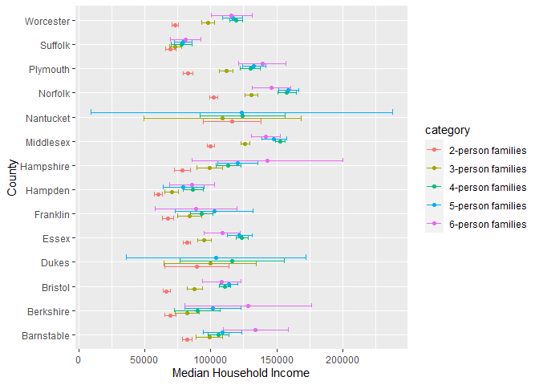
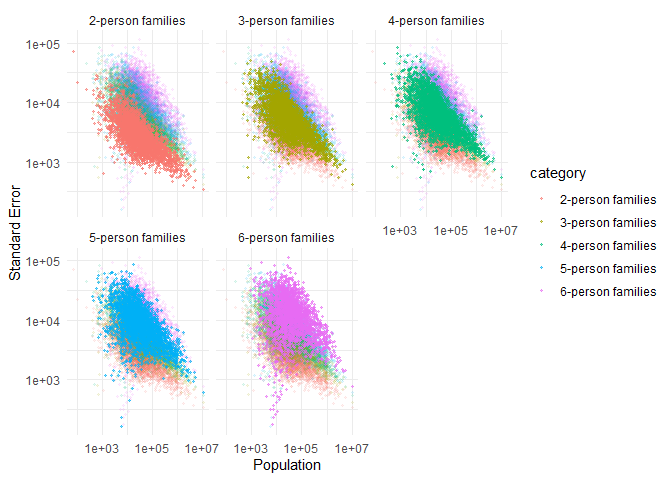
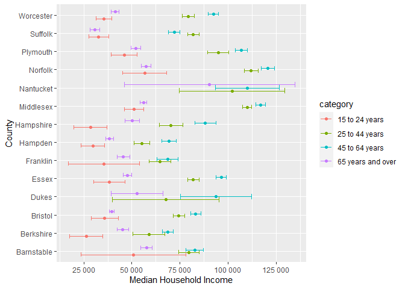

US Income
================
Jacob Smilg
2023-04-08

- [Grading Rubric](#grading-rubric)
  - [Individual](#individual)
  - [Due Date](#due-date)
- [Setup](#setup)
  - [**q1** Load the population data from c06; simply replace
    `filename_pop`
    below.](#q1-load-the-population-data-from-c06-simply-replace-filename_pop-below)
  - [**q2** Obtain median income data from the Census
    Bureau:](#q2-obtain-median-income-data-from-the-census-bureau)
  - [**q3** Tidy the `df_income` dataset by completing the code below.
    Pivot and rename the columns to arrive at the column names
    `id, geographic_area_name, category, income_estimate, income_moe`.](#q3-tidy-the-df_income-dataset-by-completing-the-code-below-pivot-and-rename-the-columns-to-arrive-at-the-column-names-id-geographic_area_name-category-income_estimate-income_moe)
  - [**q4** Convert the margin of error to standard error. Additionally,
    compute a 99% confidence interval on income, and normalize the
    standard error to `income_CV = income_SE / income_estimate`. Provide
    these columns with the names
    `income_SE, income_lo, income_hi, income_CV`.](#q4-convert-the-margin-of-error-to-standard-error-additionally-compute-a-99-confidence-interval-on-income-and-normalize-the-standard-error-to-income_cv--income_se--income_estimate-provide-these-columns-with-the-names-income_se-income_lo-income_hi-income_cv)
  - [**q5** Join `df_q4` and `df_pop`.](#q5-join-df_q4-and-df_pop)
- [Analysis](#analysis)
  - [**q6** Study the following graph, making sure to note what you can
    *and can’t* conclude based on the estimates and confidence
    intervals. Document your observations below and answer the
    questions.](#q6-study-the-following-graph-making-sure-to-note-what-you-can-and-cant-conclude-based-on-the-estimates-and-confidence-intervals-document-your-observations-below-and-answer-the-questions)
  - [**q7** Plot the standard error against population for all counties.
    Create a visual that effectively highlights the trends in the data.
    Answer the questions under *observations*
    below.](#q7-plot-the-standard-error-against-population-for-all-counties-create-a-visual-that-effectively-highlights-the-trends-in-the-data-answer-the-questions-under-observations-below)
- [Going Further](#going-further)
  - [**q8** Pose your own question about the data. Create a
    visualization (or table) here, and document your
    observations.](#q8-pose-your-own-question-about-the-data-create-a-visualization-or-table-here-and-document-your-observations)
- [References](#references)

*Purpose*: We’ve been learning how to quantify uncertainty in estimates
through the exercises; now its time to put those skills to use studying
real data. In this challenge we’ll use concepts like confidence
intervals to help us make sense of census data.

*Reading*: - [Using ACS Estimates and Margin of
Error](https://www.census.gov/programs-surveys/acs/guidance/training-presentations/acs-moe.html)
(Optional) - [Patterns and Causes of Uncertainty in the American
Community
Survey](https://www.sciencedirect.com/science/article/pii/S0143622813002518?casa_token=VddzQ1-spHMAAAAA:FTq92LXgiPVloJUVjnHs8Ma1HwvPigisAYtzfqaGbbRRwoknNq56Y2IzszmGgIGH4JAPzQN0)
(Optional, particularly the *Uncertainty in surveys* section under the
Introduction.)

<!-- include-rubric -->

# Grading Rubric

<!-- -------------------------------------------------- -->

Unlike exercises, **challenges will be graded**. The following rubrics
define how you will be graded, both on an individual and team basis.

## Individual

<!-- ------------------------- -->

| Category    | Needs Improvement                                                                                                | Satisfactory                                                                                                               |
|-------------|------------------------------------------------------------------------------------------------------------------|----------------------------------------------------------------------------------------------------------------------------|
| Effort      | Some task **q**’s left unattempted                                                                               | All task **q**’s attempted                                                                                                 |
| Observed    | Did not document observations, or observations incorrect                                                         | Documented correct observations based on analysis                                                                          |
| Supported   | Some observations not clearly supported by analysis                                                              | All observations clearly supported by analysis (table, graph, etc.)                                                        |
| Assessed    | Observations include claims not supported by the data, or reflect a level of certainty not warranted by the data | Observations are appropriately qualified by the quality & relevance of the data and (in)conclusiveness of the support      |
| Specified   | Uses the phrase “more data are necessary” without clarification                                                  | Any statement that “more data are necessary” specifies which *specific* data are needed to answer what *specific* question |
| Code Styled | Violations of the [style guide](https://style.tidyverse.org/) hinder readability                                 | Code sufficiently close to the [style guide](https://style.tidyverse.org/)                                                 |

## Due Date

<!-- ------------------------- -->

All the deliverables stated in the rubrics above are due **at midnight**
before the day of the class discussion of the challenge. See the
[Syllabus](https://docs.google.com/document/d/1qeP6DUS8Djq_A0HMllMqsSqX3a9dbcx1/edit?usp=sharing&ouid=110386251748498665069&rtpof=true&sd=true)
for more information.

# Setup

<!-- ----------------------------------------------------------------------- -->

``` r
library(tidyverse)
```

    ## ── Attaching packages ─────────────────────────────────────── tidyverse 1.3.2 ──
    ## ✔ ggplot2 3.4.0      ✔ purrr   1.0.1 
    ## ✔ tibble  3.1.8      ✔ dplyr   1.0.10
    ## ✔ tidyr   1.2.1      ✔ stringr 1.5.0 
    ## ✔ readr   2.1.3      ✔ forcats 0.5.2 
    ## ── Conflicts ────────────────────────────────────────── tidyverse_conflicts() ──
    ## ✖ dplyr::filter() masks stats::filter()
    ## ✖ dplyr::lag()    masks stats::lag()

### **q1** Load the population data from c06; simply replace `filename_pop` below.

``` r
## TODO: Give the filename for your copy of Table B01003
filename_pop <- "./data/ACSDT5Y2018.B01003-Data.csv"

## NOTE: No need to edit
df_pop <-
  read_csv(
    filename_pop,
    skip = 2,
    col_names = c(
      "id",
      "geographic_area_name",
      "population_estimate",
      "pop_est_annotation",
      "population_moe"
    )
  ) %>%
  select(-c("pop_est_annotation", "X6", "X7"))
```

    ## Rows: 3220 Columns: 7
    ## ── Column specification ────────────────────────────────────────────────────────
    ## Delimiter: ","
    ## chr (5): id, geographic_area_name, pop_est_annotation, population_moe, X6
    ## dbl (1): population_estimate
    ## lgl (1): X7
    ## 
    ## ℹ Use `spec()` to retrieve the full column specification for this data.
    ## ℹ Specify the column types or set `show_col_types = FALSE` to quiet this message.

``` r
df_pop
```

    ## # A tibble: 3,220 × 4
    ##    id             geographic_area_name     population_estimate population_moe
    ##    <chr>          <chr>                                  <dbl> <chr>         
    ##  1 0500000US01001 Autauga County, Alabama                55200 *****         
    ##  2 0500000US01003 Baldwin County, Alabama               208107 *****         
    ##  3 0500000US01005 Barbour County, Alabama                25782 *****         
    ##  4 0500000US01007 Bibb County, Alabama                   22527 *****         
    ##  5 0500000US01009 Blount County, Alabama                 57645 *****         
    ##  6 0500000US01011 Bullock County, Alabama                10352 *****         
    ##  7 0500000US01013 Butler County, Alabama                 20025 *****         
    ##  8 0500000US01015 Calhoun County, Alabama               115098 *****         
    ##  9 0500000US01017 Chambers County, Alabama               33826 *****         
    ## 10 0500000US01019 Cherokee County, Alabama               25853 *****         
    ## # … with 3,210 more rows

You might wonder why the `Margin of Error` in the population estimates
is listed as `*****`. From the [documentation (PDF
link)](https://www.google.com/url?sa=t&rct=j&q=&esrc=s&source=web&cd=&cad=rja&uact=8&ved=2ahUKEwj81Omy16TrAhXsguAKHTzKDQEQFjABegQIBxAB&url=https%3A%2F%2Fwww2.census.gov%2Fprograms-surveys%2Facs%2Ftech_docs%2Faccuracy%2FMultiyearACSAccuracyofData2018.pdf%3F&usg=AOvVaw2TOrVuBDlkDI2gde6ugce_)
for the ACS:

> If the margin of error is displayed as ‘\*\*\*\*\*’ (five asterisks),
> the estimate has been controlled to be equal to a fixed value and so
> it has no sampling error. A standard error of zero should be used for
> these controlled estimates when completing calculations, such as those
> in the following section.

This means that for cases listed as `*****` the US Census Bureau
recommends treating the margin of error (and thus standard error) as
zero.

### **q2** Obtain median income data from the Census Bureau:

- `Filter > Topics > Income and Poverty > Income and Poverty`
- `Filter > Geography > County > All counties in United States`
- Look for `Median Income in the Past 12 Months` (Table S1903)
- Download the 2018 5-year ACS estimates; save to your `data` folder and
  add the filename below.

``` r
## TODO: Give the filename for your copy of Table S1903
filename_income <- "./data/ACSST5Y2018.S1903-Data.csv"

## NOTE: No need to edit
df_income <-
  read_csv(filename_income, skip = 1) %>% 
  rename(id = Geography)
```

    ## New names:
    ## • `` -> `...483`

    ## Warning: One or more parsing issues, call `problems()` on your data frame for details,
    ## e.g.:
    ##   dat <- vroom(...)
    ##   problems(dat)

    ## Rows: 3220 Columns: 483
    ## ── Column specification ────────────────────────────────────────────────────────
    ## Delimiter: ","
    ## chr (306): Geography, Geographic Area Name, Annotation of Margin of Error!!N...
    ## dbl (176): Estimate!!Number!!HOUSEHOLD INCOME BY RACE AND HISPANIC OR LATINO...
    ## lgl   (1): ...483
    ## 
    ## ℹ Use `spec()` to retrieve the full column specification for this data.
    ## ℹ Specify the column types or set `show_col_types = FALSE` to quiet this message.

``` r
df_income 
```

    ## # A tibble: 3,220 × 483
    ##    id    Geogr…¹ Estim…² Margi…³ Annot…⁴ Annot…⁵ Estim…⁶ Margi…⁷ Annot…⁸ Annot…⁹
    ##    <chr> <chr>     <dbl>   <dbl> <chr>   <chr>     <dbl>   <dbl> <chr>   <chr>  
    ##  1 0500… Autaug…   21115     383 null    null      16585     363 null    null   
    ##  2 0500… Baldwi…   78622    1183 null    null      69544    1042 null    null   
    ##  3 0500… Barbou…    9186     280 null    null       4729     211 null    null   
    ##  4 0500… Bibb C…    6840     321 null    null       5588     346 null    null   
    ##  5 0500… Blount…   20600     396 null    null      20054     417 null    null   
    ##  6 0500… Bulloc…    3609     196 null    null        881     119 null    null   
    ##  7 0500… Butler…    6708     274 null    null       3821     173 null    null   
    ##  8 0500… Calhou…   45033     683 null    null      33820     559 null    null   
    ##  9 0500… Chambe…   13516     372 null    null       7953     296 null    null   
    ## 10 0500… Cherok…   10606     370 null    null       9953     356 null    null   
    ## # … with 3,210 more rows, 473 more variables:
    ## #   `Estimate!!Number!!HOUSEHOLD INCOME BY RACE AND HISPANIC OR LATINO ORIGIN OF HOUSEHOLDER!!Households!!One race--!!Black or African American` <dbl>,
    ## #   `Annotation of Estimate!!Number!!HOUSEHOLD INCOME BY RACE AND HISPANIC OR LATINO ORIGIN OF HOUSEHOLDER!!Households!!One race--!!Black or African American` <chr>,
    ## #   `Margin of Error!!Number MOE!!HOUSEHOLD INCOME BY RACE AND HISPANIC OR LATINO ORIGIN OF HOUSEHOLDER!!Households!!One race--!!Black or African American` <dbl>,
    ## #   `Annotation of Margin of Error!!Number MOE!!HOUSEHOLD INCOME BY RACE AND HISPANIC OR LATINO ORIGIN OF HOUSEHOLDER!!Households!!One race--!!Black or African American` <chr>,
    ## #   `Estimate!!Number!!HOUSEHOLD INCOME BY RACE AND HISPANIC OR LATINO ORIGIN OF HOUSEHOLDER!!Households!!One race--!!American Indian and Alaska Native` <dbl>,
    ## #   `Margin of Error!!Number MOE!!HOUSEHOLD INCOME BY RACE AND HISPANIC OR LATINO ORIGIN OF HOUSEHOLDER!!Households!!One race--!!American Indian and Alaska Native` <dbl>, …

Use the following test to check that you downloaded the correct file:

``` r
## NOTE: No need to edit, use to check you got the right file.
assertthat::assert_that(
  df_income %>%
    filter(id == "0500000US01001") %>%
    pull(`Estimate!!Percent Distribution!!FAMILY INCOME BY FAMILY SIZE!!2-person families`)
  == 45.6
)
```

    ## [1] TRUE

``` r
print("Well done!")
```

    ## [1] "Well done!"

This dataset is in desperate need of some *tidying*. To simplify the
task, we’ll start by considering the `\\d-person families` columns
first.

### **q3** Tidy the `df_income` dataset by completing the code below. Pivot and rename the columns to arrive at the column names `id, geographic_area_name, category, income_estimate, income_moe`.

*Hint*: You can do this in a single pivot using the `".value"` argument
and a `names_pattern` using capture groups `"()"`. Remember that you can
use an OR operator `|` in a regex to allow for multiple possibilities in
a capture group, for example `"(Estimate|Margin of Error)"`.

``` r
df_q3 <-
  df_income %>%
  select(
    id,
    contains("Geographic"),
    contains("median") & matches("\\d-person families")
  ) %>%
  mutate(across(contains("median"), as.numeric)) %>%
  pivot_longer(
    cols = -c("id", "Geographic Area Name"),
    names_to = c(".value", "category"),
    names_pattern = "(Estimate|Margin of Error).+(\\d-person families)",
    values_drop_na = TRUE
  ) %>%
  rename_with(~ str_replace_all(., " ", "_") %>% str_to_lower()) %>%
  rename(income_estimate = estimate, income_moe = margin_of_error) %>%
  glimpse()
```

    ## Warning in mask$eval_all_mutate(quo): NAs introduced by coercion

    ## Warning in mask$eval_all_mutate(quo): NAs introduced by coercion

    ## Warning in mask$eval_all_mutate(quo): NAs introduced by coercion

    ## Warning in mask$eval_all_mutate(quo): NAs introduced by coercion

    ## Warning in mask$eval_all_mutate(quo): NAs introduced by coercion

    ## Warning in mask$eval_all_mutate(quo): NAs introduced by coercion

    ## Warning in mask$eval_all_mutate(quo): NAs introduced by coercion

    ## Warning in mask$eval_all_mutate(quo): NAs introduced by coercion

    ## Warning in mask$eval_all_mutate(quo): NAs introduced by coercion

    ## Warning in mask$eval_all_mutate(quo): NAs introduced by coercion

    ## Warning in mask$eval_all_mutate(quo): NAs introduced by coercion

    ## Warning in mask$eval_all_mutate(quo): NAs introduced by coercion

    ## Warning in mask$eval_all_mutate(quo): NAs introduced by coercion

    ## Warning in mask$eval_all_mutate(quo): NAs introduced by coercion

    ## Warning in mask$eval_all_mutate(quo): NAs introduced by coercion

    ## Warning in mask$eval_all_mutate(quo): NAs introduced by coercion

    ## Warning in mask$eval_all_mutate(quo): NAs introduced by coercion

    ## Warning in mask$eval_all_mutate(quo): NAs introduced by coercion

    ## Rows: 15,286
    ## Columns: 5
    ## $ id                   <chr> "0500000US01001", "0500000US01001", "0500000US010…
    ## $ geographic_area_name <chr> "Autauga County, Alabama", "Autauga County, Alaba…
    ## $ category             <chr> "2-person families", "3-person families", "4-pers…
    ## $ income_estimate      <dbl> 64947, 80172, 85455, 88601, 103787, 63975, 79390,…
    ## $ income_moe           <dbl> 6663, 14181, 10692, 20739, 12387, 2297, 8851, 519…

Use the following tests to check your work:

``` r
## NOTE: No need to edit
assertthat::assert_that(setequal(
  names(df_q3),
  c("id", "geographic_area_name", "category", "income_estimate", "income_moe")
))
```

    ## [1] TRUE

``` r
assertthat::assert_that(
  df_q3 %>%
    filter(id == "0500000US01001", category == "2-person families") %>%
    pull(income_moe)
  == 6663
)
```

    ## [1] TRUE

``` r
print("Nice!")
```

    ## [1] "Nice!"

The data gives finite values for the Margin of Error, which is closely
related to the Standard Error. The Census Bureau documentation gives the
following relationship between Margin of Error and Standard Error:

$$\text{MOE} = 1.645 \times \text{SE}.$$

### **q4** Convert the margin of error to standard error. Additionally, compute a 99% confidence interval on income, and normalize the standard error to `income_CV = income_SE / income_estimate`. Provide these columns with the names `income_SE, income_lo, income_hi, income_CV`.

``` r
q99 <- qnorm( 1 - (1 - 0.99) / 2 )
  
df_q4 <-
  df_q3 %>% 
  group_by(id) %>%
  mutate(
    income_SE = income_moe / 1.645,
    income_CV = income_SE / income_estimate,
    income_lo = income_estimate - q99 * income_SE,
    income_hi = income_estimate + q99 * income_SE
  )

df_q4
```

    ## # A tibble: 15,286 × 9
    ## # Groups:   id [3,219]
    ##    id            geogr…¹ categ…² incom…³ incom…⁴ incom…⁵ incom…⁶ incom…⁷ incom…⁸
    ##    <chr>         <chr>   <chr>     <dbl>   <dbl>   <dbl>   <dbl>   <dbl>   <dbl>
    ##  1 0500000US010… Autaug… 2-pers…   64947    6663   4050.  0.0624  54514.  75380.
    ##  2 0500000US010… Autaug… 3-pers…   80172   14181   8621.  0.108   57967. 102377.
    ##  3 0500000US010… Autaug… 4-pers…   85455   10692   6500.  0.0761  68713. 102197.
    ##  4 0500000US010… Autaug… 5-pers…   88601   20739  12607.  0.142   56127. 121075.
    ##  5 0500000US010… Autaug… 6-pers…  103787   12387   7530.  0.0726  84391. 123183.
    ##  6 0500000US010… Baldwi… 2-pers…   63975    2297   1396.  0.0218  60378.  67572.
    ##  7 0500000US010… Baldwi… 3-pers…   79390    8851   5381.  0.0678  65531.  93249.
    ##  8 0500000US010… Baldwi… 4-pers…   88458    5199   3160.  0.0357  80317.  96599.
    ##  9 0500000US010… Baldwi… 5-pers…   91259    7011   4262.  0.0467  80281. 102237.
    ## 10 0500000US010… Baldwi… 6-pers…   69609   23175  14088.  0.202   33320. 105898.
    ## # … with 15,276 more rows, and abbreviated variable names
    ## #   ¹​geographic_area_name, ²​category, ³​income_estimate, ⁴​income_moe,
    ## #   ⁵​income_SE, ⁶​income_CV, ⁷​income_lo, ⁸​income_hi

Use the following tests to check your work:

``` r
## NOTE: No need to edit
assertthat::assert_that(setequal(
  names(df_q4),
  c("id", "geographic_area_name", "category", "income_estimate", "income_moe",
    "income_SE", "income_lo", "income_hi", "income_CV")
))
```

    ## [1] TRUE

``` r
assertthat::assert_that(
  abs(
    df_q4 %>%
    filter(id == "0500000US01001", category == "2-person families") %>%
    pull(income_SE) - 4050.456
  ) / 4050.456 < 1e-3
)
```

    ## [1] TRUE

``` r
assertthat::assert_that(
  abs(
    df_q4 %>%
    filter(id == "0500000US01001", category == "2-person families") %>%
    pull(income_lo) - 54513.72
  ) / 54513.72 < 1e-3
)
```

    ## [1] TRUE

``` r
assertthat::assert_that(
  abs(
    df_q4 %>%
    filter(id == "0500000US01001", category == "2-person families") %>%
    pull(income_hi) - 75380.28
  ) / 75380.28 < 1e-3
)
```

    ## [1] TRUE

``` r
assertthat::assert_that(
  abs(
    df_q4 %>%
    filter(id == "0500000US01001", category == "2-person families") %>%
    pull(income_CV) - 0.06236556
  ) / 0.06236556 < 1e-3
)
```

    ## [1] TRUE

``` r
print("Nice!")
```

    ## [1] "Nice!"

One last wrangling step: We need to join the two datasets so we can
compare population with income.

### **q5** Join `df_q4` and `df_pop`.

``` r
df_data <-
  left_join(df_q4, df_pop)
```

    ## Joining, by = c("id", "geographic_area_name")

``` r
df_data
```

    ## # A tibble: 15,286 × 11
    ## # Groups:   id [3,219]
    ##    id    geogr…¹ categ…² incom…³ incom…⁴ incom…⁵ incom…⁶ incom…⁷ incom…⁸ popul…⁹
    ##    <chr> <chr>   <chr>     <dbl>   <dbl>   <dbl>   <dbl>   <dbl>   <dbl>   <dbl>
    ##  1 0500… Autaug… 2-pers…   64947    6663   4050.  0.0624  54514.  75380.   55200
    ##  2 0500… Autaug… 3-pers…   80172   14181   8621.  0.108   57967. 102377.   55200
    ##  3 0500… Autaug… 4-pers…   85455   10692   6500.  0.0761  68713. 102197.   55200
    ##  4 0500… Autaug… 5-pers…   88601   20739  12607.  0.142   56127. 121075.   55200
    ##  5 0500… Autaug… 6-pers…  103787   12387   7530.  0.0726  84391. 123183.   55200
    ##  6 0500… Baldwi… 2-pers…   63975    2297   1396.  0.0218  60378.  67572.  208107
    ##  7 0500… Baldwi… 3-pers…   79390    8851   5381.  0.0678  65531.  93249.  208107
    ##  8 0500… Baldwi… 4-pers…   88458    5199   3160.  0.0357  80317.  96599.  208107
    ##  9 0500… Baldwi… 5-pers…   91259    7011   4262.  0.0467  80281. 102237.  208107
    ## 10 0500… Baldwi… 6-pers…   69609   23175  14088.  0.202   33320. 105898.  208107
    ## # … with 15,276 more rows, 1 more variable: population_moe <chr>, and
    ## #   abbreviated variable names ¹​geographic_area_name, ²​category,
    ## #   ³​income_estimate, ⁴​income_moe, ⁵​income_SE, ⁶​income_CV, ⁷​income_lo,
    ## #   ⁸​income_hi, ⁹​population_estimate

# Analysis

<!-- ----------------------------------------------------------------------- -->

We now have both estimates and confidence intervals for
`\\d-person families`. Now we can compare cases with quantified
uncertainties: Let’s practice!

### **q6** Study the following graph, making sure to note what you can *and can’t* conclude based on the estimates and confidence intervals. Document your observations below and answer the questions.

``` r
## NOTE: No need to edit; run and inspect
wid <- 0.5

df_data %>%
  filter(str_detect(geographic_area_name, "Massachusetts")) %>%
  mutate(
    county = str_remove(geographic_area_name, " County,.*$"),
    county = fct_reorder(county, income_estimate)
  ) %>%

  ggplot(aes(county, income_estimate, color = category)) +
  geom_errorbar(
    aes(ymin = income_lo, ymax = income_hi),
    position = position_dodge(width = wid)
  ) +
  geom_point(position = position_dodge(width = wid)) +

  coord_flip() +
  labs(
    x = "County",
    y = "Median Household Income"
  )
```

<!-- -->

**Observations**:

- Document your observations here.
  - Median household income tends to be larger for larger families, but
    this is not always the case, and the confidence intervals overlap
    for many of the larger family sizes.
  - In most of the counties, 2-person families have the smallest median
    income.
- Can you confidently distinguish between household incomes in Suffolk
  county? Why or why not?
  - Not really; the confidence intervals for all of the family sizes
    overlap. You could still make general statements about the overall
    distribution.
- Which counties have the widest confidence intervals?
  - Nantucket, Hampshire, Dukes, and Berkshire have some really wide
    intervals.

In the next task you’ll investigate the relationship between population
and uncertainty.

### **q7** Plot the standard error against population for all counties. Create a visual that effectively highlights the trends in the data. Answer the questions under *observations* below.

*Hint*: Remember that standard error is a function of *both* variability
(e.g. variance) and sample size.

``` r
df_data %>%
  mutate(
    county = str_remove(geographic_area_name, " County,.*$"),
    county = fct_reorder(county, income_estimate),
    category_2 = category
  ) %>%
  ggplot(aes(population_estimate, income_SE, color = category)) +
  geom_point(
    data = . %>% select(-category),
    aes(population_estimate, income_SE, color = category_2),
    alpha = 0.1,
    size = 0.7
  ) +
  geom_point(alpha = 0.5, size = 0.7) +
  scale_y_log10() +
  scale_x_log10() +
  facet_wrap(~ category) +
  theme_minimal() +
  labs(
    x = "Population",
    y = "Standard Error"
  )
```

<!-- -->

**Observations**:

- What *overall* trend do you see between `SE` and population? Why might
  this trend exist?
  - Higher population → lower `SE`
- What does this *overall* trend tell you about the relative ease of
  studying small vs large counties?
  - Studying large counties is easier since there is less uncertainty.

# Going Further

<!-- ----------------------------------------------------------------------- -->

Now it’s your turn! You have income data for every county in the United
States: Pose your own question and try to answer it with the data.

### **q8** Pose your own question about the data. Create a visualization (or table) here, and document your observations.

**I’m doing the same thing as q3-q6, but with age of the householder
instead of family size.**

``` r
df_q8 <-
  df_income %>%
  select(
    id,
    contains("Geographic"),
    contains("median") & matches("\\d+ to \\d+ years|65 years and over")
  ) %>%
  mutate(across(contains("median"), as.numeric)) %>%
  pivot_longer(
    cols = -c("id", "Geographic Area Name"),
    names_to = c(".value", "category"),
    names_pattern = "(Estimate|Margin of Error).+?(\\d+ to \\d+ years|65 years and over)",
    values_drop_na = TRUE
  ) %>%
  rename_with(~ str_replace_all(., " ", "_") %>% str_to_lower()) %>%
  rename(income_estimate = estimate, income_moe = margin_of_error) %>%
  
  group_by(id) %>%
  mutate(
    income_SE = income_moe / 1.645,
    income_CV = income_SE / income_estimate,
    income_lo = income_estimate - q99 * income_SE,
    income_hi = income_estimate + q99 * income_SE
  ) %>% 
  left_join(df_pop)
```

    ## Warning in mask$eval_all_mutate(quo): NAs introduced by coercion

    ## Warning in mask$eval_all_mutate(quo): NAs introduced by coercion

    ## Warning in mask$eval_all_mutate(quo): NAs introduced by coercion

    ## Warning in mask$eval_all_mutate(quo): NAs introduced by coercion

    ## Warning in mask$eval_all_mutate(quo): NAs introduced by coercion

    ## Warning in mask$eval_all_mutate(quo): NAs introduced by coercion

    ## Warning in mask$eval_all_mutate(quo): NAs introduced by coercion

    ## Warning in mask$eval_all_mutate(quo): NAs introduced by coercion

    ## Warning in mask$eval_all_mutate(quo): NAs introduced by coercion

    ## Warning in mask$eval_all_mutate(quo): NAs introduced by coercion

    ## Warning in mask$eval_all_mutate(quo): NAs introduced by coercion

    ## Warning in mask$eval_all_mutate(quo): NAs introduced by coercion

    ## Warning in mask$eval_all_mutate(quo): NAs introduced by coercion

    ## Warning in mask$eval_all_mutate(quo): NAs introduced by coercion

    ## Joining, by = c("id", "geographic_area_name")

``` r
df_q8
```

    ## # A tibble: 12,440 × 11
    ## # Groups:   id [3,219]
    ##    id    geogr…¹ categ…² incom…³ incom…⁴ incom…⁵ incom…⁶ incom…⁷ incom…⁸ popul…⁹
    ##    <chr> <chr>   <chr>     <dbl>   <dbl>   <dbl>   <dbl>   <dbl>   <dbl>   <dbl>
    ##  1 0500… Autaug… 25 to …   61203    4583   2786.  0.0455  54027.  68379.   55200
    ##  2 0500… Autaug… 45 to …   79748    5751   3496.  0.0438  70743.  88753.   55200
    ##  3 0500… Autaug… 65 yea…   40822    5108   3105.  0.0761  32824.  48820.   55200
    ##  4 0500… Baldwi… 15 to …   40051    5279   3209.  0.0801  31785.  48317.  208107
    ##  5 0500… Baldwi… 25 to …   62192    3827   2326.  0.0374  56199.  68185.  208107
    ##  6 0500… Baldwi… 45 to …   63921    2567   1560.  0.0244  59901.  67941.  208107
    ##  7 0500… Baldwi… 65 yea…   45680    1847   1123.  0.0246  42788.  48572.  208107
    ##  8 0500… Barbou… 15 to …   17788    7151   4347.  0.244    6591.  28985.   25782
    ##  9 0500… Barbou… 25 to …   35140    6613   4020.  0.114   24785.  45495.   25782
    ## 10 0500… Barbou… 45 to …   40255    3537   2150.  0.0534  34717.  45793.   25782
    ## # … with 12,430 more rows, 1 more variable: population_moe <chr>, and
    ## #   abbreviated variable names ¹​geographic_area_name, ²​category,
    ## #   ³​income_estimate, ⁴​income_moe, ⁵​income_SE, ⁶​income_CV, ⁷​income_lo,
    ## #   ⁸​income_hi, ⁹​population_estimate

``` r
library(scales)
```

    ## 
    ## Attaching package: 'scales'

    ## The following object is masked from 'package:purrr':
    ## 
    ##     discard

    ## The following object is masked from 'package:readr':
    ## 
    ##     col_factor

``` r
df_q8 %>% 
  filter(str_detect(geographic_area_name, "Massachusetts")) %>%
  mutate(
    county = str_remove(geographic_area_name, " County,.*$"),
    county = fct_reorder(county, income_estimate)
  ) %>%

  ggplot(aes(county, income_estimate, color = category)) +
  geom_errorbar(
    aes(ymin = income_lo, ymax = income_hi),
    position = position_dodge(width = wid)
  ) +
  geom_point(position = position_dodge(width = wid)) +

  coord_flip() +
  scale_y_continuous(labels = label_number(), breaks = breaks_extended(n = 6)) +
  labs(
    x = "County",
    y = "Median Household Income"
  )
```

<!-- -->

**Observations**:

- There’s a fairly consistent pattern of 15-24 year old and 65 and over
  householders having a lower income than 25-64 year olds.
- The split between the age categories is often fairly large, up to
  around \$50k.

Ideas:

- Compare trends across counties that are relevant to you; e.g. places
  you’ve lived, places you’ve been, places in the US that are
  interesting to you.
- In q3 we tidied the median `\\d-person families` columns only.
  - Tidy the other median columns to learn about other people groups.
  - Tidy the percentage columns to learn about how many households of
    each category are in each county.
- Your own idea!

# References

<!-- ----------------------------------------------------------------------- -->

\[1\] Spielman SE, Folch DC, Nagle NN (2014) Patterns and causes of
uncertainty in the American Community Survey. Applied Geography 46:
147–157. <pmid:25404783>
[link](https://www.sciencedirect.com/science/article/pii/S0143622813002518?casa_token=VddzQ1-spHMAAAAA:FTq92LXgiPVloJUVjnHs8Ma1HwvPigisAYtzfqaGbbRRwoknNqZ6Y2IzszmGgIGH4JAPzQN0)
