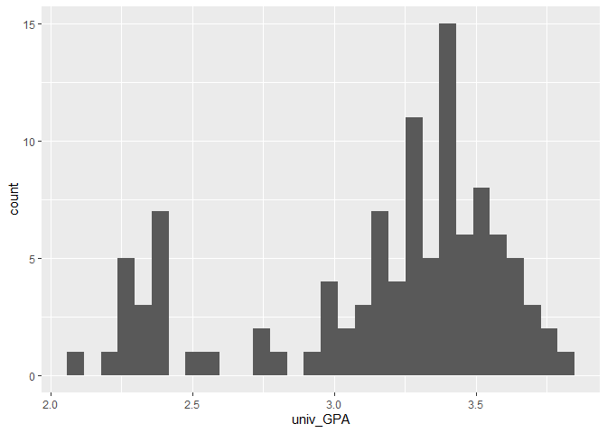

SAT and College Grades
================
Jacob Smilg
2023-04-19 (Revised 2023-05-01)

- [Grading Rubric](#grading-rubric)
  - [Individual](#individual)
  - [Due Date](#due-date)
- [Obtain the Data](#obtain-the-data)
  - [**q1** Visit the SAT and College GPA case study page, scroll to the
    bottom, and click the `Open Data with Excel` button. This will allow
    you to download an `xls` file. Save the file to your `data` folder,
    load the data as `df_sat`, and perform your “first checks” against
    these data. Answer the questions
    below:](#q1-visit-the-sat-and-college-gpa-case-study-page-scroll-to-the-bottom-and-click-the-open-data-with-excel-button-this-will-allow-you-to-download-an-xls-file-save-the-file-to-your-data-folder-load-the-data-as-df_sat-and-perform-your-first-checks-against-these-data-answer-the-questions-below)
- [Analysis with Hypothesis Testing](#analysis-with-hypothesis-testing)
  - [View 1: Correlations](#view-1-correlations)
    - [**q2** Create a *single* plot that shows `univ_GPA` against
      *both* `high_GPA` and `both_SAT`. Visually compare the two
      trends.](#q2-create-a-single-plot-that-shows-univ_gpa-against-both-high_gpa-and-both_sat-visually-compare-the-two-trends)
    - [Hypothesis Testing with a Correlation
      Coefficient](#hypothesis-testing-with-a-correlation-coefficient)
    - [**q3** Plot histograms for `both_SAT, high_GPA, univ_GPA`.
      Which—if any—of the variables look approximately normally
      distributed.](#q3-plot-histograms-for-both_sat-high_gpa-univ_gpa-whichif-anyof-the-variables-look-approximately-normally-distributed)
    - [**q4** Use the function `cor.test()` to construct confidence
      intervals for `corr[high_GPA, univ_GPA]` and
      `corr[both_SAT, univ_GPA]`. Answer the questions
      below.](#q4-use-the-function-cortest-to-construct-confidence-intervals-for-corrhigh_gpa-univ_gpa-and-corrboth_sat-univ_gpa-answer-the-questions-below)
    - [**q5** Use the bootstrap to approximate a confidence
      interval](#q5-use-the-bootstrap-to-approximate-a-confidence-interval)
  - [View 2: Modeling](#view-2-modeling)
    - [Hypothesis Testing with a
      Model](#hypothesis-testing-with-a-model)
    - [**q6** Fit a linear model predicting `univ_GPA` with the
      predictor `both_SAT`. Assess the model to determine how effective
      a predictor `both_SAT` is for `univ_GPA`. Interpret the resulting
      confidence interval for the coefficient on
      `both_SAT`.](#q6-fit-a-linear-model-predicting-univ_gpa-with-the-predictor-both_sat-assess-the-model-to-determine-how-effective-a-predictor-both_sat-is-for-univ_gpa-interpret-the-resulting-confidence-interval-for-the-coefficient-on-both_sat)
    - [**q7** Fit a model predicting `univ_GPA` using both `high_GPA`
      and `both_SAT`. Compare the prediction accuracy and hypothesis
      test
      results.](#q7-fit-a-model-predicting-univ_gpa-using-both-high_gpa-and-both_sat-compare-the-prediction-accuracy-and-hypothesis-test-results)
  - [Synthesize](#synthesize)
    - [**q8** Using the results from all previous q’s, answer the
      following
      questions.](#q8-using-the-results-from-all-previous-qs-answer-the-following-questions)
- [End Notes](#end-notes)

*Purpose*: How do we apply hypothesis testing to investigating data? In
this challenge you’ll practice using hypothesis testing tools to make
sense of a dataset.

*Reading*: - [Harvard Study Says SATs Should Be Optional: Here’s
Why](https://www.csmonitor.com/USA/USA-Update/2016/0120/Harvard-study-says-SATs-should-be-optional.-Here-s-why)
(Optional); easy-to-read news article on colleges going SAT-free -
[Norm-Referenced Tests and Race-Blind
Admissions](https://cshe.berkeley.edu/publications/norm-referenced-tests-and-race-blind-admissions-case-eliminating-sat-and-act-university)
(Optional); technical report on relationship between the SAT/ACT and
non-academic factors

*Credit*: This is based on a [case
study](http://onlinestatbook.com/2/case_studies/sat.html) originally
prepared by Emily Zitek, with data collected through the research of
Thomas MacFarland.

``` r
library(tidyverse)
```

    ## ── Attaching packages ─────────────────────────────────────── tidyverse 1.3.2 ──
    ## ✔ ggplot2 3.4.0      ✔ purrr   1.0.1 
    ## ✔ tibble  3.1.8      ✔ dplyr   1.0.10
    ## ✔ tidyr   1.2.1      ✔ stringr 1.5.0 
    ## ✔ readr   2.1.3      ✔ forcats 0.5.2 
    ## ── Conflicts ────────────────────────────────────────── tidyverse_conflicts() ──
    ## ✖ dplyr::filter() masks stats::filter()
    ## ✖ dplyr::lag()    masks stats::lag()

``` r
library(readxl)
library(broom)
library(modelr)
```

    ## 
    ## Attaching package: 'modelr'
    ## 
    ## The following object is masked from 'package:broom':
    ## 
    ##     bootstrap

``` r
library(rsample)
library(vctrs)
```

    ## 
    ## Attaching package: 'vctrs'
    ## 
    ## The following object is masked from 'package:dplyr':
    ## 
    ##     data_frame
    ## 
    ## The following object is masked from 'package:tibble':
    ## 
    ##     data_frame

<!-- include-rubric -->

# Grading Rubric

<!-- -------------------------------------------------- -->

Unlike exercises, **challenges will be graded**. The following rubrics
define how you will be graded, both on an individual and team basis.

## Individual

<!-- ------------------------- -->

| Category    | Needs Improvement                                                                                                | Satisfactory                                                                                                               |
|-------------|------------------------------------------------------------------------------------------------------------------|----------------------------------------------------------------------------------------------------------------------------|
| Effort      | Some task **q**’s left unattempted                                                                               | All task **q**’s attempted                                                                                                 |
| Observed    | Did not document observations, or observations incorrect                                                         | Documented correct observations based on analysis                                                                          |
| Supported   | Some observations not clearly supported by analysis                                                              | All observations clearly supported by analysis (table, graph, etc.)                                                        |
| Assessed    | Observations include claims not supported by the data, or reflect a level of certainty not warranted by the data | Observations are appropriately qualified by the quality & relevance of the data and (in)conclusiveness of the support      |
| Specified   | Uses the phrase “more data are necessary” without clarification                                                  | Any statement that “more data are necessary” specifies which *specific* data are needed to answer what *specific* question |
| Code Styled | Violations of the [style guide](https://style.tidyverse.org/) hinder readability                                 | Code sufficiently close to the [style guide](https://style.tidyverse.org/)                                                 |

## Due Date

<!-- ------------------------- -->

All the deliverables stated in the rubrics above are due **at midnight**
before the day of the class discussion of the challenge. See the
[Syllabus](https://docs.google.com/document/d/1qeP6DUS8Djq_A0HMllMqsSqX3a9dbcx1/edit?usp=sharing&ouid=110386251748498665069&rtpof=true&sd=true)
for more information.

*Background*: Every year about 2 million students take the Scholastic
Aptitude Test (SAT). The exam is
[controversial](http://www.nea.org/home/73288.htm) but [extremely
consequential](https://www.csmonitor.com/2004/0518/p13s01-legn.html).
There are many claims about the SAT, but we’re going to look at just
one: Is the SAT predictive of scholastic performance in college? It
turns out this is a fairly complicated question to assess—we’ll get an
introduction to some of the complexities.

# Obtain the Data

<!-- -------------------------------------------------- -->

### **q1** Visit the [SAT and College GPA](http://onlinestatbook.com/2/case_studies/sat.html) case study page, scroll to the bottom, and click the `Open Data with Excel` button. This will allow you to download an `xls` file. Save the file to your `data` folder, load the data as `df_sat`, and perform your “first checks” against these data. Answer the questions below:

``` r
df_sat <- read_excel("data/sat.xls")

df_sat
```

    ## # A tibble: 105 × 5
    ##    high_GPA math_SAT verb_SAT comp_GPA univ_GPA
    ##       <dbl>    <dbl>    <dbl>    <dbl>    <dbl>
    ##  1     3.45      643      589     3.76     3.52
    ##  2     2.78      558      512     2.87     2.91
    ##  3     2.52      583      503     2.54     2.4 
    ##  4     3.67      685      602     3.83     3.47
    ##  5     3.24      592      538     3.29     3.47
    ##  6     2.1       562      486     2.64     2.37
    ##  7     2.82      573      548     2.86     2.4 
    ##  8     2.36      559      536     2.03     2.24
    ##  9     2.42      552      583     2.81     3.02
    ## 10     3.51      617      591     3.41     3.32
    ## # … with 95 more rows

``` r
df_sat %>% summarise()
```

    ## # A tibble: 1 × 0

**Observations**:

- Fill in the following “data dictionary”

| Column     | Meaning                                |
|------------|----------------------------------------|
| `high_GPA` | High school grade point average        |
| `math_SAT` | Math SAT score                         |
| `verb_SAT` | Verbal SAT score                       |
| `comp_GPA` | Computer science grade point average   |
| `univ_GPA` | Overall university grade point average |

- What information do we have about these students?
  - GPAs and SAT scores.
- What kinds of information *do we not have* about these students?
  - Demographics, more granular GPAs, what high school they attended,
    accomodations present, when they took the SAT, when they graduated
    high school, when they graduated college, etc.
- Based on these missing variables, what possible effects could be
  present in the data that we would have *no way of detecting*?
  - Scores could be skewed by what school they went to, GPAs and scores
    could be skewed by outside circumstances that make them less useful,
    students may all have had tutors increasing their scores (or the
    opposite), etc.

# Analysis with Hypothesis Testing

<!-- ----------------------------------------------------------------------- -->

We’re going to use two complementary approaches to analyze the data, the
first based on hypothesis testing of correlation coefficients, and the
second based on fitting a regression model and interpreting the
regression coefficients.

To simplify the analysis, let’s look at a composite SAT score:

``` r
## NOTE: No need to edit this
df_composite <-
  df_sat %>%
  mutate(both_SAT = math_SAT + verb_SAT)
```

## View 1: Correlations

<!-- ----------------------------------------------------------------------- -->

### **q2** Create a *single* plot that shows `univ_GPA` against *both* `high_GPA` and `both_SAT`. Visually compare the two trends.

*Hint*: One way to do this is to first *pivot* `df_composite`.

``` r
df_composite %>%
  pivot_longer(
    cols = c(high_GPA, both_SAT),
    names_to = "stat",
    values_to = "val"
  ) %>% 
  ggplot() +
  geom_point(aes(val, univ_GPA, color = stat)) +
  facet_wrap(vars(stat), scales = "free", strip.position = "bottom") +
  theme_minimal()
```

<!-- -->

**Observations**:

- What relationship do `univ_GPA` and `both_SAT` exhibit?
  - `univ_GPA` and `both_SAT` exhibit a positive relationship.
- What relationship do `univ_GPA` and `high_GPA` exhibit?
  - `univ_GPA` and `high_GPA` exhibit a positive relationship.
- Both trends have a small cluster towards the lower-left corners (low
  GPA, low SAT score) and a larger cluster closer to the upper-right
  corners. The small cluster for `univ_GPA` vs. `both_SAT` appears to be
  a bit less spread out than the small cluster in `univ_GPA`
  vs. `high_GPA`. The opposite is true for the large cluster.

### Hypothesis Testing with a Correlation Coefficient

<!-- ------------------------- -->

We can use the idea of hypothesis testing with a correlation
coefficient. The idea is to set our null hypothesis to the case where
there is no correlation, and test to see if the data contradict that
perspective. Formally, the null (H0) and alternative (HA) hypotheses
relating to a correlation coefficient between two variables `X, Y` are:

$$\text{H0: } \text{Corr}[X, Y] = 0$$

$$\text{HA: } \text{Corr}[X, Y] \neq 0$$

The R function `cor.test` implements such a hypothesis test under the
assumption that `X, Y` are both normally distributed. First, let’s check
to see if this assumption looks reasonable for our data.

### **q3** Plot histograms for `both_SAT, high_GPA, univ_GPA`. Which—if any—of the variables look approximately normally distributed.

``` r
df_composite %>% 
  ggplot() +
  geom_histogram(aes(both_SAT), binwidth = 40, boundary = 1100)
```

<!-- -->

``` r
df_composite %>% 
  ggplot() +
  geom_histogram(aes(high_GPA))
```

    ## `stat_bin()` using `bins = 30`. Pick better value with `binwidth`.

<!-- -->

``` r
df_composite %>% 
  ggplot() +
  geom_histogram(aes(univ_GPA))
```

    ## `stat_bin()` using `bins = 30`. Pick better value with `binwidth`.

<!-- -->

**Observations**:

- To what extent does `both_SAT` look like a normal distribution?
  - It looks like the upper portion of a normal distribution centered
    around 1100 or so - there are a few spikes that make it look less
    normal, though.
- To what extent does `high_GPA` look like a normal distribution?
  - It doesn’t look much like a normal distribution.
- To what extent does `univ_GPA` look like a normal distribution?
  - It doesn’t look much like a normal distribution.

Keep in mind your findings as you complete q4.

### **q4** Use the function `cor.test()` to construct confidence intervals for `corr[high_GPA, univ_GPA]` and `corr[both_SAT, univ_GPA]`. Answer the questions below.

``` r
## Use the function cor.test() to test the correlations between
##       high_GPA and univ_GPA, as well as between
##       both_SAT and univ_GPA
print("univ_GPA vs. high_GPA")
```

    ## [1] "univ_GPA vs. high_GPA"

``` r
df_composite %>%
  { cor.test(pull(., high_GPA), pull(., univ_GPA)) }
```

    ## 
    ##  Pearson's product-moment correlation
    ## 
    ## data:  pull(., high_GPA) and pull(., univ_GPA)
    ## t = 12.632, df = 103, p-value < 2.2e-16
    ## alternative hypothesis: true correlation is not equal to 0
    ## 95 percent confidence interval:
    ##  0.6911690 0.8449761
    ## sample estimates:
    ##       cor 
    ## 0.7795631

``` r
print("univ_GPA vs. both_SAT")
```

    ## [1] "univ_GPA vs. both_SAT"

``` r
df_composite %>%
  { cor.test(pull(., both_SAT), pull(., univ_GPA)) }
```

    ## 
    ##  Pearson's product-moment correlation
    ## 
    ## data:  pull(., both_SAT) and pull(., univ_GPA)
    ## t = 9.5339, df = 103, p-value = 8.052e-16
    ## alternative hypothesis: true correlation is not equal to 0
    ## 95 percent confidence interval:
    ##  0.5674824 0.7746821
    ## sample estimates:
    ##       cor 
    ## 0.6846776

**Observations**:

- Which correlations are significantly nonzero?
  - Both of them.
- Which of `high_GPA` and `both_SAT` seems to be more strongly
  correlated with `univ_GPA`?
  - `high_GPA`
- How do the results here compare with the visual you created in q2?
  - The results seem to line up well with the q2 visual.
- Based on these results, what can we say about the predictive
  capabilities of both `high_GPA` and `both_SAT` to predict `univ_GPA`?
  - Both `high_GPA` and `both_SAT` could be used to make decent
    predictions of `univ_GPA`. `high_GPA` would be better at predicting
    `univ_GPA`.

Finally, let’s use the bootstrap to perform the same test using
*different* assumptions.

### **q5** Use the bootstrap to approximate a confidence interval

Use the bootstrap to approximate a confidence interval for
`cor[high_GPA, univ_GPA]`. Compare your results—both the estimate and
confidence interval—to your results from q4.

*Hint 1*. The `cor(x, y)` function computes the correlation between two
variables `x` and `y`. You may find this more helpful than the
`cor.test()` function we used above.

*Hint 2*. You’ll find that the documentation for `int_pctl` has some
**really** useful examples for this task!

``` r
set.seed(sum(utf8ToInt("😢😔😟☹️😥😢😭😖😞😓🥹")))
# i don't think this is how i'm supposed to do this, but it's my best guess...
df_composite %>%
  # do bootstrapping etc
  select(c(high_GPA, univ_GPA)) %>% 
  bootstraps(times = 1000) %>%
  mutate(
    df = map(splits, ~ analysis(.x)),
  # do cor.test on all of the bootstrap samples
    corr = map(
      df,
      ~ cor.test(.$high_GPA, .$univ_GPA) %>% list()
    )
  ) %>% 
  # painfully unpack the cor.test results - this is probably a dumb way to do it
  unnest(corr) %>%
  pull(corr) %>%
  `[` %>% `[` %>%
  map(
    ~ append(., as.vector(data.frame(lohi = c("lo", "hi")))) %>% 
    as_tibble() %>%
    pivot_wider(
      id_cols = c("estimate"),
      names_from = lohi,
      values_from = conf.int
    )
  ) %>%
  bind_rows() %>%
  # calculate means of all of the estimates and CIs
  summarise(
    estimate = mean(estimate),
    lo = mean(lo),
    hi = mean(hi)
  )
```

    ## # A tibble: 1 × 3
    ##   estimate    lo    hi
    ##      <dbl> <dbl> <dbl>
    ## 1    0.780 0.692 0.845

**Observations**:

- How does your estimate from q5 compare with your estimate from q4?
  - My q4 estimate is 0.7795631, and my q5 estimate is 0.7795262. They
    are within one ten-thousandth of each other.
- How does your CI from q5 compare with your CI from q4?
  - My q4 CI is \[0.6911690 0.8449761\] and my q5 CI is \[0.6916051
    0.8447514\]. They are also almost the same.

*Aside*: When you use two different approximations to compute the same
quantity and get similar results, that’s an *encouraging sign*. Such an
outcome lends a bit more credibility to the results.

## View 2: Modeling

<!-- ------------------------- -->

Correlations are useful for relating two variables at a time. To study
the relationship among more variables we can instead use a fitted model.
Using a model, we can also help assess whether it is *worthwhile* to
measure a variable.

To begin, let’s first split the data into training and validation sets.

``` r
## NOTE: No need to edit
set.seed(101)

df_train <-
  df_composite %>%
  rowid_to_column() %>%
  slice_sample(n = 80)

df_validate <-
  df_composite %>%
  rowid_to_column() %>%
  anti_join(
    .,
    df_train,
    by = "rowid"
  )
```

### Hypothesis Testing with a Model

<!-- ------------------------- -->

We can combine the ideas of hypothesis testing with a model. Using a
model, we can express our hypotheses in terms of the model parameters.
For instance, if we were interested in whether $X$ has an affect on $Y$,
we might set up a model:

$$Y_i = \beta X_i + \epsilon_i$$

With the hypotheses:

$$\text{H0}: \beta = 0$$

$$\text{HA}: \beta \neq 0$$

In this case, we’re testing for whether $X$ has a significant effect on
$Y$. Let’s apply this idea to relating the variables `univ_GPA` and
`high_GPA`. Luckily R has built-in tools to construct a confidence
interval on the $\beta$’s in a regression \[1\]; we’ll simply use those
tools rather than do it by hand.

### **q6** Fit a linear model predicting `univ_GPA` with the predictor `both_SAT`. Assess the model to determine how effective a predictor `both_SAT` is for `univ_GPA`. Interpret the resulting confidence interval for the coefficient on `both_SAT`.

``` r
## Fit a model of univ_GPA on the predictor both_SAT
fit_basic <- 
  df_train %>% 
  lm(
    data = .,
    formula = univ_GPA ~ both_SAT
  )

## NOTE: The following computes confidence intervals on regression coefficients
fit_basic %>%
  tidy(
    conf.int = TRUE,
    conf.level = 0.99
  )
```

    ## # A tibble: 2 × 7
    ##   term        estimate std.error statistic  p.value conf.low conf.high
    ##   <chr>          <dbl>     <dbl>     <dbl>    <dbl>    <dbl>     <dbl>
    ## 1 (Intercept)  0.0260   0.396       0.0655 9.48e- 1 -1.02      1.07   
    ## 2 both_SAT     0.00257  0.000322    7.97   1.08e-11  0.00172   0.00342

``` r
print("basic MSE:")
```

    ## [1] "basic MSE:"

``` r
mse(fit_basic, df_validate)
```

    ## [1] 0.09188292

``` r
print("basic r-squared:")
```

    ## [1] "basic r-squared:"

``` r
rsquare(fit_basic, df_validate)
```

    ## [1] 0.5383881

**Observations**:

- What is the confidence interval on the coefficient of `both_SAT`? Is
  this coefficient significantly different from zero?
  - \[0.001715376 0.003415381\]. It is significantly different from
    zero.
- By itself, how well does `both_SAT` predict `univ_GPA`?
  - Not very well - the r-squared is 0.5383881, which isn’t very high,
    but does suggest that it can predict `univ_GPA` with low accuracy.

Remember from `e-model03-interp-warnings` that there are challenges with
interpreting regression coefficients! Let’s investigate that idea
further.

### **q7** Fit a model predicting `univ_GPA` using both `high_GPA` and `both_SAT`. Compare the prediction accuracy and hypothesis test results.

``` r
## TODO: Fit and assess models with predictors both_SAT + high_GPA, and high_GPA alone
fit_bofa <- 
  df_train %>% 
  lm(
    data = .,
    formula = univ_GPA ~ both_SAT + high_GPA
  )

## NOTE: The following computes confidence intervals on regression coefficients
fit_bofa %>%
  tidy(
    conf.int = TRUE,
    conf.level = 0.99
  )
```

    ## # A tibble: 3 × 7
    ##   term        estimate std.error statistic     p.value  conf.low conf.high
    ##   <chr>          <dbl>     <dbl>     <dbl>       <dbl>     <dbl>     <dbl>
    ## 1 (Intercept) 0.758     0.362         2.09 0.0397      -0.199      1.71   
    ## 2 both_SAT    0.000534  0.000457      1.17 0.247       -0.000674   0.00174
    ## 3 high_GPA    0.570     0.103         5.55 0.000000396  0.299      0.842

``` r
print("bofa MSE:")
```

    ## [1] "bofa MSE:"

``` r
mse(fit_bofa, df_validate)
```

    ## [1] 0.06359633

``` r
print("bofa r-squared:")
```

    ## [1] "bofa r-squared:"

``` r
rsquare(fit_bofa, df_validate)
```

    ## [1] 0.6757461

**Observations**:

- How well do these models perform, compared to the one you built in q6?
  - This one is better than the one from q6.
- What is the confidence interval on the coefficient of `both_SAT` when
  including `high_GPA` as a predictor?? Is this coefficient
  significantly different from zero?
  - \[-0.0006740696 0.001741962\]. It’s even closer to zero than before.
- How do the hypothesis test results compare with the results in q6?
  - The results agree that `high_GPA` is a better predictor of
    `univ_GPA`, but q6 seems to contradict the hypothesis tests by
    showing that `both_SAT` is not a good predictor of `univ_GPA`.

## Synthesize

<!-- ------------------------- -->

Before closing, let’s synthesize a bit from the analyses above.

### **q8** Using the results from all previous q’s, answer the following questions.

**Observations**:

- Between `both_SAT` and `high_GPA`, which single variable would you
  choose to predict `univ_GPA`? Why?
  - `high_GPA`. In all of the methods used to evaluate its quality as a
    predictor of `univ_GPA`, it was shown to be better than `both_SAT`.
- Is `both_SAT` an effective predictor of `univ_GPA`? What specific
  pieces of evidence do you have in favor of `both_SAT` being effective?
  What specific pieces of evidence do you have against?
  - `both_SAT` is not an effective predictor of `univ_GPA`. The
    correlation coefficients are the only pieces of evidence in favor of
    `both_SAT`, but they’re still not very high. The linear models are
    evidence against `both_SAT`. Also, it makes sense (intuitively, so
    not really evidence, per se) that it wouldn’t be a good predictor,
    especially in comparison to GPA, since it is simply a different
    metric. There are many high schoolers that are great at standardized
    tests that still have poor GPAs due to work ethic and other factors.

# End Notes

<!-- ----------------------------------------------------------------------- -->

\[1\] There are also assumptions underlying this kind of testing, for
more information see this [Wiki
article](https://en.wikipedia.org/wiki/Linear_regression#Assumptions).
