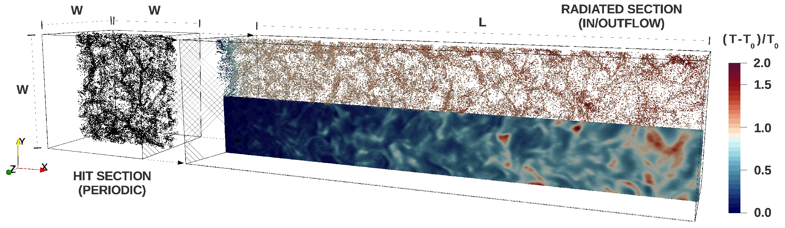
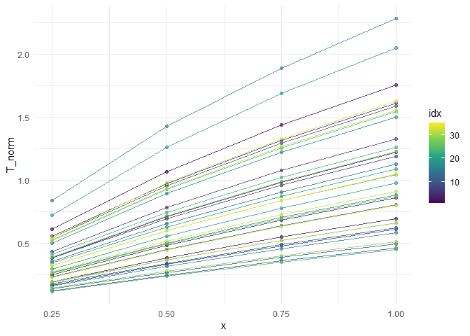
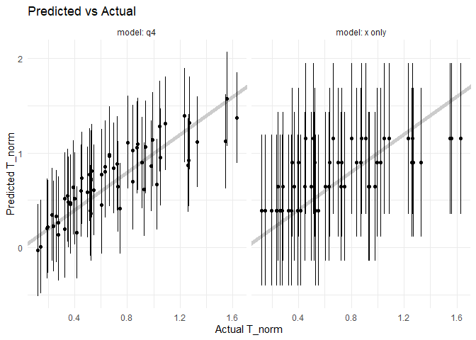

Regression Case Study: PSAAP II
================
Jacob Smilg
2023-04-26

- [Grading Rubric](#grading-rubric)
  - [Individual](#individual)
  - [Due Date](#due-date)
- [Orientation: Exploring Simulation
  Results](#orientation-exploring-simulation-results)
  - [**q1** Perform your “initial checks” to get a sense of the
    data.](#q1-perform-your-initial-checks-to-get-a-sense-of-the-data)
  - [**q2** Visualize `T_norm` against `x`. Note that there are multiple
    simulations at different values of the Input variables: Each
    simulation result is identified by a different value of
    `idx`.](#q2-visualize-t_norm-against-x-note-that-there-are-multiple-simulations-at-different-values-of-the-input-variables-each-simulation-result-is-identified-by-a-different-value-of-idx)
  - [Modeling](#modeling)
    - [**q3** The following code chunk fits a few different models.
      Compute a measure of model accuracy for each model on
      `df_validate`, and compare their
      performance.](#q3-the-following-code-chunk-fits-a-few-different-models-compute-a-measure-of-model-accuracy-for-each-model-on-df_validate-and-compare-their-performance)
    - [**q4** Use a combination of EDA and train-validation error to
      build a model by selecting *reasonable* predictors for the
      `formula` argument. Document your findings under *observations*
      below. Try to build the most accurate model you
      can!](#q4-use-a-combination-of-eda-and-train-validation-error-to-build-a-model-by-selecting-reasonable-predictors-for-the-formula-argument-document-your-findings-under-observations-below-try-to-build-the-most-accurate-model-you-can)
  - [Contrasting CI and PI](#contrasting-ci-and-pi)
    - [**q5** The following code will construct a predicted-vs-actual
      plot with your model from *q4* and add prediction intervals. Study
      the results and answer the questions below under
      *observations*.](#q5-the-following-code-will-construct-a-predicted-vs-actual-plot-with-your-model-from-q4-and-add-prediction-intervals-study-the-results-and-answer-the-questions-below-under-observations)
- [Case Study: Predicting Performance
  Ranges](#case-study-predicting-performance-ranges)
  - [**q6** You are consulting with a team that is designing a prototype
    heat transfer device. They are asking you to help determine a
    *dependable range of values* for `T_norm` they can design around for
    this *single prototype*. The realized value of `T_norm` must not be
    too high as it may damage the downstream equipment, but it must also
    be high enough to extract an acceptable amount of
    heat.](#q6-you-are-consulting-with-a-team-that-is-designing-a-prototype-heat-transfer-device-they-are-asking-you-to-help-determine-a-dependable-range-of-values-for-t_norm-they-can-design-around-for-this-single-prototype-the-realized-value-of-t_norm-must-not-be-too-high-as-it-may-damage-the-downstream-equipment-but-it-must-also-be-high-enough-to-extract-an-acceptable-amount-of-heat)
- [References](#references)

*Purpose*: Confidence and prediction intervals are useful for studying
“pure sampling” of some distribution. However, we can combine CI and PI
with regression analysis to equip our modeling efforts with powerful
notions of uncertainty. In this challenge, you will use fluid simulation
data in a regression analysis with uncertainty quantification (CI and
PI) to support engineering design.

<!-- include-rubric -->

# Grading Rubric

<!-- -------------------------------------------------- -->

Unlike exercises, **challenges will be graded**. The following rubrics
define how you will be graded, both on an individual and team basis.

## Individual

<!-- ------------------------- -->

| Category    | Needs Improvement                                                                                                | Satisfactory                                                                                                               |
|-------------|------------------------------------------------------------------------------------------------------------------|----------------------------------------------------------------------------------------------------------------------------|
| Effort      | Some task **q**’s left unattempted                                                                               | All task **q**’s attempted                                                                                                 |
| Observed    | Did not document observations, or observations incorrect                                                         | Documented correct observations based on analysis                                                                          |
| Supported   | Some observations not clearly supported by analysis                                                              | All observations clearly supported by analysis (table, graph, etc.)                                                        |
| Assessed    | Observations include claims not supported by the data, or reflect a level of certainty not warranted by the data | Observations are appropriately qualified by the quality & relevance of the data and (in)conclusiveness of the support      |
| Specified   | Uses the phrase “more data are necessary” without clarification                                                  | Any statement that “more data are necessary” specifies which *specific* data are needed to answer what *specific* question |
| Code Styled | Violations of the [style guide](https://style.tidyverse.org/) hinder readability                                 | Code sufficiently close to the [style guide](https://style.tidyverse.org/)                                                 |

## Due Date

<!-- ------------------------- -->

All the deliverables stated in the rubrics above are due **at midnight**
before the day of the class discussion of the challenge. See the
[Syllabus](https://docs.google.com/document/d/1qeP6DUS8Djq_A0HMllMqsSqX3a9dbcx1/edit?usp=sharing&ouid=110386251748498665069&rtpof=true&sd=true)
for more information.

``` r
library(tidyverse)
```

    ## ── Attaching packages ─────────────────────────────────────── tidyverse 1.3.2 ──
    ## ✔ ggplot2 3.4.0      ✔ purrr   1.0.1 
    ## ✔ tibble  3.1.8      ✔ dplyr   1.0.10
    ## ✔ tidyr   1.2.1      ✔ stringr 1.5.0 
    ## ✔ readr   2.1.3      ✔ forcats 0.5.2 
    ## ── Conflicts ────────────────────────────────────────── tidyverse_conflicts() ──
    ## ✖ dplyr::filter() masks stats::filter()
    ## ✖ dplyr::lag()    masks stats::lag()

``` r
library(modelr)
library(broom)
```

    ## 
    ## Attaching package: 'broom'
    ## 
    ## The following object is masked from 'package:modelr':
    ## 
    ##     bootstrap

``` r
library(viridisLite)

## Helper function to compute uncertainty bounds
add_uncertainties <- function(data, model, prefix = "pred", ...) {
  df_fit <-
    stats::predict(model, data, ...) %>%
    as_tibble() %>%
    rename_with(~ str_c(prefix, "_", .))

  bind_cols(data, df_fit)
}
```

# Orientation: Exploring Simulation Results

*Background*: The data you will study in this exercise come from a
computational fluid dynamics (CFD) [simulation
campaign](https://www.sciencedirect.com/science/article/abs/pii/S0301932219308651?via%3Dihub)
that studied the interaction of turbulent flow and radiative heat
transfer to fluid-suspended particles\[1\]. These simulations were
carried out to help study a novel design of [solar
receiver](https://en.wikipedia.org/wiki/Concentrated_solar_power),
though they are more aimed at fundamental physics than detailed device
design. The following code chunk downloads and unpacks the data to your
local `./data/` folder.

``` r
## NOTE: No need to edit this chunk
## Download PSAAP II data and unzip
url_zip <- "https://ndownloader.figshare.com/files/24111269"
filename_zip <- "./data/psaap.zip"
filename_psaap <- "./data/psaap.csv"

curl::curl_download(url_zip, destfile = filename_zip)
unzip(filename_zip, exdir = "./data")
df_psaap <- read_csv(filename_psaap)
```

    ## Rows: 140 Columns: 22
    ## ── Column specification ────────────────────────────────────────────────────────
    ## Delimiter: ","
    ## dbl (22): x, idx, L, W, U_0, N_p, k_f, T_f, rho_f, mu_f, lam_f, C_fp, rho_p,...
    ## 
    ## ℹ Use `spec()` to retrieve the full column specification for this data.
    ## ℹ Specify the column types or set `show_col_types = FALSE` to quiet this message.

 Figure 1. An
example simulation, frozen at a specific point in time. An initial
simulation is run (HIT SECTION) to generate a turbulent flow with
particles, and that swirling flow is released into a rectangular domain
(RADIATED SECTION) with bulk downstream flow (left to right).
Concentrated solar radiation transmits through the optically transparent
fluid, but deposits heat into the particles. The particles then convect
heat into the fluid, which heats up the flow. The false-color image
shows the fluid temperature: Notice that there are “hot spots” where hot
particles have deposited heat into the fluid. The dataset `df_psaap`
gives measurements of `T_norm = (T - T0) / T0` averaged across planes at
various locations along the RADIATED SECTION.

### **q1** Perform your “initial checks” to get a sense of the data.

``` r
df_psaap
```

    ## # A tibble: 140 × 22
    ##        x   idx     L      W   U_0    N_p    k_f   T_f rho_f    mu_f  lam_f  C_fp
    ##    <dbl> <dbl> <dbl>  <dbl> <dbl>  <dbl>  <dbl> <dbl> <dbl>   <dbl>  <dbl> <dbl>
    ##  1  0.25     1 0.190 0.0342  1.86 1.60e6 0.0832  300. 1.16  1.52e-5 0.0316 1062.
    ##  2  0.25     2 0.151 0.0464  2.23 2.22e6 0.111   243. 1.13  1.84e-5 0.0259 1114.
    ##  3  0.25     3 0.169 0.0398  2.04 1.71e6 0.0867  290. 1.10  2.18e-5 0.0349  952.
    ##  4  0.25     4 0.135 0.0325  2.45 2.08e6 0.121   358. 1.23  2.23e-5 0.0370  998.
    ##  5  0.25     5 0.201 0.0441  1.70 1.95e6 0.0904  252. 1.44  2.28e-5 0.0356  937.
    ##  6  0.25     6 0.160 0.0379  1.96 1.82e6 0.0798  280. 0.964 2.13e-5 0.0249 1224.
    ##  7  0.25     7 0.179 0.0360  2.36 2.36e6 0.102   261. 1.40  2.03e-5 0.0322  813.
    ##  8  0.25     8 0.143 0.0488  2.15 1.57e6 0.0982  270. 1.02  1.98e-5 0.0329  967.
    ##  9  0.25     9 0.184 0.0419  2.58 2.18e6 0.107   322. 1.07  1.56e-5 0.0292 1186.
    ## 10  0.25    10 0.147 0.0336  1.79 1.68e6 0.0942  333. 1.04  1.80e-5 0.0280  826.
    ## # … with 130 more rows, and 10 more variables: rho_p <dbl>, d_p <dbl>,
    ## #   C_pv <dbl>, h <dbl>, I_0 <dbl>, eps_p <dbl>, avg_q <dbl>, avg_T <dbl>,
    ## #   rms_T <dbl>, T_norm <dbl>

``` r
df_psaap %>% pull(x) %>% unique()
```

    ## [1] 0.25 0.50 0.75 1.00

``` r
df_psaap %>% pull(idx) %>% max()
```

    ## [1] 35

``` r
df_psaap %>% arrange(idx)
```

    ## # A tibble: 140 × 22
    ##        x   idx     L      W   U_0    N_p    k_f   T_f rho_f    mu_f  lam_f  C_fp
    ##    <dbl> <dbl> <dbl>  <dbl> <dbl>  <dbl>  <dbl> <dbl> <dbl>   <dbl>  <dbl> <dbl>
    ##  1  0.25     1 0.190 0.0342  1.86 1.60e6 0.0832  300.  1.16 1.52e-5 0.0316 1062.
    ##  2  0.5      1 0.190 0.0342  1.86 1.60e6 0.0832  300.  1.16 1.52e-5 0.0316 1062.
    ##  3  0.75     1 0.190 0.0342  1.86 1.60e6 0.0832  300.  1.16 1.52e-5 0.0316 1062.
    ##  4  1        1 0.190 0.0342  1.86 1.60e6 0.0832  300.  1.16 1.52e-5 0.0316 1062.
    ##  5  0.25     2 0.151 0.0464  2.23 2.22e6 0.111   243.  1.13 1.84e-5 0.0259 1114.
    ##  6  0.5      2 0.151 0.0464  2.23 2.22e6 0.111   243.  1.13 1.84e-5 0.0259 1114.
    ##  7  0.75     2 0.151 0.0464  2.23 2.22e6 0.111   243.  1.13 1.84e-5 0.0259 1114.
    ##  8  1        2 0.151 0.0464  2.23 2.22e6 0.111   243.  1.13 1.84e-5 0.0259 1114.
    ##  9  0.25     3 0.169 0.0398  2.04 1.71e6 0.0867  290.  1.10 2.18e-5 0.0349  952.
    ## 10  0.5      3 0.169 0.0398  2.04 1.71e6 0.0867  290.  1.10 2.18e-5 0.0349  952.
    ## # … with 130 more rows, and 10 more variables: rho_p <dbl>, d_p <dbl>,
    ## #   C_pv <dbl>, h <dbl>, I_0 <dbl>, eps_p <dbl>, avg_q <dbl>, avg_T <dbl>,
    ## #   rms_T <dbl>, T_norm <dbl>

**Observations**:

- All of the columns aside from `x`, `idx`, `avg_q`, `avg_T`, `rms_T`,
  and `T_norm` appear to be coefficients for some awful mech-e equation.
- There are only 4 values of `x`: 0.25, 0.50, 0.75, 1.00
- `idx` is unique for each row for each value of `x` (i.e. it counts
  1-35, `x` increments by 0.25, and `idx` starts again from 1).
- The parameters are all the same for individual values of `idx`.

The important variables in this dataset are:

| Variable | Category | Meaning                           |
|----------|----------|-----------------------------------|
| `x`      | Spatial  | Channel location                  |
| `idx`    | Metadata | Simulation run                    |
| `L`      | Input    | Channel length                    |
| `W`      | Input    | Channel width                     |
| `U_0`    | Input    | Bulk velocity                     |
| `N_p`    | Input    | Number of particles               |
| `k_f`    | Input    | Turbulence level                  |
| `T_f`    | Input    | Fluid inlet temp                  |
| `rho_f`  | Input    | Fluid density                     |
| `mu_f`   | Input    | Fluid viscosity                   |
| `lam_f`  | Input    | Fluid conductivity                |
| `C_fp`   | Input    | Fluid isobaric heat capacity      |
| `rho_p`  | Input    | Particle density                  |
| `d_p`    | Input    | Particle diameter                 |
| `C_pv`   | Input    | Particle isochoric heat capacity  |
| `h`      | Input    | Convection coefficient            |
| `I_0`    | Input    | Radiation intensity               |
| `eps_p`  | Input    | Radiation absorption coefficient  |
| `avg_q`  | Output   | Plane-averaged heat flux          |
| `avg_T`  | Output   | Plane-averaged fluid temperature  |
| `rms_T`  | Output   | Plane-rms fluid temperature       |
| `T_norm` | Output   | Normalized fluid temperature rise |

The primary output of interest is `T_norm = (avg_T - T_f) / T_f`, the
normalized (dimensionless) temperature rise of the fluid, due to heat
transfer. These measurements are taken at locations `x` along a column
of fluid, for different experimental settings (e.g. different dimensions
`W, L`, different flow speeds `U_0`, etc.).

### **q2** Visualize `T_norm` against `x`. Note that there are multiple simulations at different values of the Input variables: Each simulation result is identified by a different value of `idx`.

``` r
## Visualize the data in df_psaap with T_norm against x;
##       design your visual to handle the multiple simulations,
##       each identified by different values of idx
df_psaap %>%
  ggplot(aes(x, T_norm, group = idx, color = idx)) +
  geom_point(alpha = 0.6) +
  geom_line(alpha = 0.8) +
  scale_x_continuous(breaks = unique(df_psaap$x)) +
  scale_color_viridis_c() +
  theme_minimal()
```

<!-- -->

## Modeling

The following chunk will split the data into training and validation
sets.

``` r
## NOTE: No need to edit this chunk
# Addl' Note: These data are already randomized by idx; no need
# to additionally shuffle the data!
df_train <- df_psaap %>% filter(idx %in% 1:20)
df_validate <- df_psaap %>% filter(idx %in% 21:36)
```

One of the key decisions we must make in modeling is choosing predictors
(features) from our observations to include in the model. Ideally we
should have some intuition for why these predictors are reasonable to
include in the model; for instance, we saw above that location along the
flow `x` tends to affect the temperature rise `T_norm`. This is because
fluid downstream has been exposed to solar radiation for longer, and
thus is likely to be at a higher temperature.

Reasoning about our variables—at least at a *high level*—can help us to
avoid including *fallacious* predictors in our models. You’ll explore
this idea in the next task.

### **q3** The following code chunk fits a few different models. Compute a measure of model accuracy for each model on `df_validate`, and compare their performance.

``` r
## NOTE: No need to edit these models
fit_baseline <- 
  df_train %>% 
  lm(formula = T_norm ~ x)

fit_cheat <- 
  df_train %>% 
  lm(formula = T_norm ~ avg_T)

fit_nonphysical <- 
  df_train %>% 
  lm(formula = T_norm ~ idx)

## Compute a measure of accuracy for each fit above;
##       compare their relative performance
map_dfr(
  list(fit_baseline, fit_cheat, fit_nonphysical),
  function(fit) {
    tibble(mse = mse(fit, df_validate), rsquare = rsquare(fit, df_validate))
  }
) %>% add_column(fit = c("baseline (x)", "cheat (avg_T)", "nonphysical (idx)"), .before = "mse")
```

    ## # A tibble: 3 × 3
    ##   fit                  mse rsquare
    ##   <chr>              <dbl>   <dbl>
    ## 1 baseline (x)      0.0809 0.475  
    ## 2 cheat (avg_T)     0.0537 0.637  
    ## 3 nonphysical (idx) 0.159  0.00190

**Observations**:

- Which model is *most accurate*? Which is *least accurate*?
  - Cheat is most accurate; it has the lowest MSE and highest r-square.
    The least accurate is nonphysical.
- What *Category* of variable is `avg_T`? Why is it such an effective
  predictor?
  - `avg_T` is an output. It is such an effective predictor because it
    has a clear, direct relationship to `T_norm`;
    `T_norm = (avg_T - T_f) / T_f`.
- Would we have access to `avg_T` if we were trying to predict a *new*
  value of `T_norm`? Is `avg_T` a valid predictor?
  - No; since `avg_T` is another output of the system, we wouldn’t have
    access to it when trying to predict a new `T_norm`. This makes it an
    invalid predictor, or at least not a very useful one - if you
    already have one output, you shouldn’t need to predict another
    output - you probably have it already.
- What *Category* of variable is `idx`? Does it have any physical
  meaning?
  - `idx` is metadata. It has no physical meaning, but it is associated
    with a specific set of parameters (inputs).

### **q4** Use a combination of EDA and train-validation error to build a model by selecting *reasonable* predictors for the `formula` argument. Document your findings under *observations* below. Try to build the most accurate model you can!

``` r
## TODO: Fit a model for T_norm using only *principled* predictors, try to
##       optimize your validation error.
# Compute correlations for all of the variables
map_dfr(
  df_train,
  function(predictor) {
    cor(predictor, df_train$T_norm)
  }
) %>% 
  { sort(abs(.), decreasing = TRUE) }
```

    ## Warning in xtfrm.data.frame(x): cannot xtfrm data frames

    ## # A tibble: 1 × 22
    ##   T_norm avg_T     x   I_0 avg_q  C_fp rms_T     W   T_f   U_0 rho_p lam_f   N_p
    ##    <dbl> <dbl> <dbl> <dbl> <dbl> <dbl> <dbl> <dbl> <dbl> <dbl> <dbl> <dbl> <dbl>
    ## 1      1 0.881 0.590 0.533 0.531 0.459 0.453 0.431 0.337 0.309 0.301 0.297 0.273
    ## # … with 9 more variables: L <dbl>, d_p <dbl>, h <dbl>, rho_f <dbl>,
    ## #   C_pv <dbl>, mu_f <dbl>, eps_p <dbl>, idx <dbl>, k_f <dbl>

``` r
fit_q4 <-
  df_train %>% 
  lm(formula = T_norm ~ x + I_0 + W + L + T_f + U_0)

## NOTE: No need to change these error calculations; use them to
##       help define your model
rsquare(fit_q4, df_train)
```

    ## [1] 0.7859008

``` r
rsquare(fit_q4, df_validate)
```

    ## [1] 0.7155843

**Observations**:

- Not all of the highest correlations are with outputs - `avg_q` and
  `rms_T` have smaller correlations than `x` and `I_0`.
- I’ve selected `x`, `I_0`, `W`, `L`, `T_f`, and `U_0` as my predictors
  based on their correlation coefficients and that I think they would be
  reasonable to control for or calculate in a real application.
- *Note*: You don’t just have to fiddle with `formula`! Remember that
  you have a whole toolkit of *EDA* tools

## Contrasting CI and PI

Let’s revisit the ideas of confidence intervals (CI) and prediction
intervals (PI). Let’s fit a very simple model to these data, one which
only considers the channel location and ignores all other inputs. We’ll
also use the helper function `add_uncertainties()` (defined in the
`setup` chunk above) to add approximate CI and PI to the linear model.

``` r
## NOTE: No need to edit this chunk
fit_simple <-
  df_train %>%
  lm(data = ., formula = T_norm ~ x)

df_intervals <-
  df_train %>%
  add_uncertainties(fit_simple, interval = "confidence", prefix = "ci") %>%
  add_uncertainties(fit_simple, interval = "prediction", prefix = "pi")
```

The following figure visualizes the regression CI and PI against the
objects they are attempting to capture:

``` r
## NOTE: No need to edit this chunk
df_intervals %>%
  select(T_norm, x, matches("ci|pi")) %>%
  pivot_longer(
    names_to = c("method", ".value"),
    names_sep = "_",
    cols = matches("ci|pi")
  ) %>%

  ggplot(aes(x, fit)) +
  geom_errorbar(
    aes(ymin = lwr, ymax = upr, color = method),
    width = 0.05,
    size = 1
  ) +
  geom_smooth(
    data = df_psaap %>% mutate(method = "ci"),
    mapping = aes(x, T_norm),
    se = FALSE,
    linetype = 2,
    color = "black"
   ) +
  geom_point(
    data = df_validate %>% mutate(method = "pi"),
    mapping = aes(x, T_norm),
    size = 0.5
  ) +

  facet_grid(~method) +
  theme_minimal() +
  labs(
    x = "Channel Location (-)",
    y = "Normalized Temperature Rise (-)"
  )
```

    ## Warning: Using `size` aesthetic for lines was deprecated in ggplot2 3.4.0.
    ## ℹ Please use `linewidth` instead.

    ## `geom_smooth()` using method = 'loess' and formula = 'y ~ x'

    ## Warning in simpleLoess(y, x, w, span, degree = degree, parametric =
    ## parametric, : pseudoinverse used at 0.24625

    ## Warning in simpleLoess(y, x, w, span, degree = degree, parametric =
    ## parametric, : neighborhood radius 0.50375

    ## Warning in simpleLoess(y, x, w, span, degree = degree, parametric =
    ## parametric, : reciprocal condition number 2.0889e-16

    ## Warning in simpleLoess(y, x, w, span, degree = degree, parametric =
    ## parametric, : There are other near singularities as well. 0.25376

<!-- -->

Under the `ci` facet we have the regression confidence intervals and the
mean trend (computed with all the data `df_psaap`). Under the `pi` facet
we have the regression prediction intervals and the `df_validation`
observations.

**Punchline**:

- Confidence intervals are meant to capture the *mean trend*
- Prediction intervals are meant to capture *new observations*

Both CI and PI are a quantification of the uncertainty in our model, but
the two intervals designed to answer different questions.

Since CI and PI are a quantification of uncertainty, they should tend to
*narrow* as our model becomes more confident in its predictions.
Building a more accurate model will often lead to a reduction in
uncertainty. We’ll see this phenomenon in action with the following
task:

### **q5** The following code will construct a predicted-vs-actual plot with your model from *q4* and add prediction intervals. Study the results and answer the questions below under *observations*.

``` r
## TODO: Run this code and interpret the results
## NOTE: No need to edit this chunk
## NOTE: This chunk will use your model from q4; it will predict on the
##       validation data, add prediction intervals for every prediction,
##       and visualize the results on a predicted-vs-actual plot. It will
##       also compare against the simple `fit_simple` defined above.
bind_rows(
  df_validate %>% 
    add_uncertainties(fit_simple, interval = "prediction", prefix = "pi") %>% 
    select(T_norm, pi_lwr, pi_fit, pi_upr) %>% 
    mutate(model = "x only"),
  df_validate %>% 
    add_uncertainties(fit_q4, interval = "prediction", prefix = "pi") %>% 
    select(T_norm, pi_lwr, pi_fit, pi_upr) %>% 
    mutate(model = "q4"),
) %>% 
  
  ggplot(aes(T_norm, pi_fit)) +
  geom_abline(slope = 1, intercept = 0, color = "grey80", size = 2) +
  geom_errorbar(
    aes(ymin = pi_lwr, ymax = pi_upr),
    width = 0
  ) +
  geom_point() +
  
  facet_grid(~ model, labeller = label_both) +
  theme_minimal() +
  labs(
    title = "Predicted vs Actual",
    x = "Actual T_norm",
    y = "Predicted T_norm"
  )
```

<!-- -->

**Observations**:

- Which model tends to be more accurate? How can you tell from this
  predicted-vs-actual plot?
  - My model (q4) tends to be more accurate. In the plot, you can see
    that the fit line is closer to the points on the plot.
- Which model tends to be *more confident* in its predictions? Put
  differently, which model has *narrower prediction intervals*?
  - My model (q4) tends to be more confident - it’s PIs are much
    narrower.
- How many predictors does the `fit_simple` model need in order to make
  a prediction? What about your model `fit_q4`?
  - `fit_simple` only needs one predictor (`x`), while `fit_q4` needs
    six (`x`, `I_0`, `W`, `L`, `T_f`, `U_0`).

Based on these results, you might be tempted to always throw every
reasonable variable into the model. For some cases, that might be the
best choice. However, some variables might be *outside our control*; for
example, variables involving human behavior cannot be fully under our
control. Other variables may be *too difficult to measure*; for example,
it is *in theory* possible to predict the strength of a component by
having detailed knowledge of its microstructure. However, it is
*patently infeasible* to do a detailed study of *every single component*
that gets used in an airplane.

In both cases—human behavior and variable material properties—we would
be better off treating those quantities as random variables. There are
at least two ways we could treat these factors: 1. Explicitly model some
inputs as random variables and construct a model that *propagates* that
uncertainty from inputs to outputs, or 2. Implicitly model the
uncontrolled the uncontrolled variables by not including them as
predictors in the model, and instead relying on the error term
$\epsilon$ to represent these unaccounted factors. You will pursue
strategy 2. in the following Case Study.

# Case Study: Predicting Performance Ranges

### **q6** You are consulting with a team that is designing a prototype heat transfer device. They are asking you to help determine a *dependable range of values* for `T_norm` they can design around for this *single prototype*. The realized value of `T_norm` must not be too high as it may damage the downstream equipment, but it must also be high enough to extract an acceptable amount of heat.

In order to maximize the conditions under which this device can operate
successfully, the design team has chosen to fix the variables listed in
the table below, and consider the other variables to fluctuate according
to the values observed in `df_psaap`.

| Variable | Value    |
|----------|----------|
| `x`      | 1.0      |
| `L`      | 0.2      |
| `W`      | 0.04     |
| `U_0`    | 1.0      |
| (Other)  | (Varies) |

Your task is to use a regression analysis to deliver to the design team
a *dependable range* of values for `T_norm`, given their proposed
design, and at a fairly high level `0.8`. Perform your analysis below
(use the helper function `add_uncertainties()`!) , and answer the
questions below.

*Hint*: This problem will require you to *build a model* by choosing the
appropriate variables to include in the analysis. Think about *which
variables the design team can control*, and *which variables they have
chosen to allow to vary*. You will also need to choose between computing
a CI or PI for the design prediction.

``` r
# NOTE: No need to change df_design; this is the target the client
#       is considering
df_design <- tibble(x = 1, L = 0.2, W = 0.04, U_0 = 1.0)
# NOTE: This is the level the "probability" level customer wants
pr_level <- 0.8

## TODO: Fit a model, assess the uncertainty in your prediction, 
#        use the validation data to check your uncertainty estimates, and 
#        make a recommendation on a *dependable range* of values for T_norm
#        at the point `df_design`
fit_q6 <-
  df_train %>%
  lm(data = ., formula = T_norm ~ x + L + W + U_0)

df_design %>%
  add_uncertainties(fit_q6, interval = "prediction", prefix = "pi", level = pr_level) %>% 
  select(pi_fit, pi_lwr, pi_upr)
```

    ## # A tibble: 1 × 3
    ##   pi_fit pi_lwr pi_upr
    ##    <dbl>  <dbl>  <dbl>
    ## 1   1.88   1.46   2.30

``` r
df_validate %>% filter(T_norm > 1.45685 & T_norm < 2.296426) %>% count() / count(df_validate)
```

    ##      n
    ## 1 0.05

**Recommendation**:

- How much do you trust your model? Why?
  - I don’t trust it that much - there’s a lot a data in `df_psaap`, but
    only 1/4th of it is at `x=1`, and only 1/2 of that data is used to
    train the model. That ends up working out to only around 17-18 data
    points that are directly comparable to the prototype I’m trying to
    predict for.
- What kind of interval—confidence or prediction—would you use for this
  task, and why?
  - Prediction - the team wants a prediction for a single prototype, not
    one that’s general to any parameters.
- What fraction of validation cases lie within the interval you predict?
  How does this compare with `pr_level`?
  - 0.05. This is way smaller than `pr_level`.
- What interval for `T_norm` would you recommend the design team to plan
  around?
  - \[1.45685, 2.296426\]
- Are there any other recommendations you would provide?
  - Give me more data so I can make a better model!

*Bonus*: One way you could take this analysis further is to recommend
which other variables the design team should tightly control. You could
do this by fixing values in `df_design` and adding them to the model. An
exercise you could carry out would be to systematically test the
variables to see which ones the design team should more tightly control.

# References

- \[1\] Jofre, del Rosario, and Iaccarino “Data-driven dimensional
  analysis of heat transfer in irradiated particle-laden turbulent
  flow” (2020) *International Journal of Multiphase Flow*,
  <https://doi.org/10.1016/j.ijmultiphaseflow.2019.103198>
